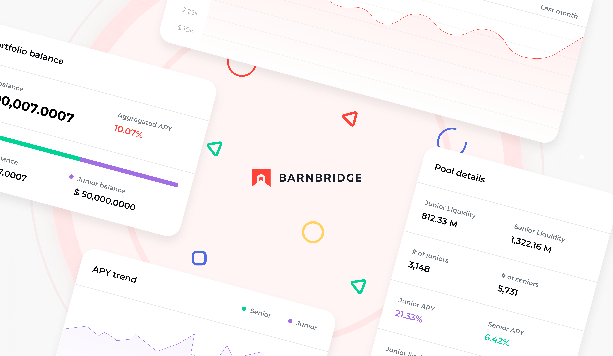
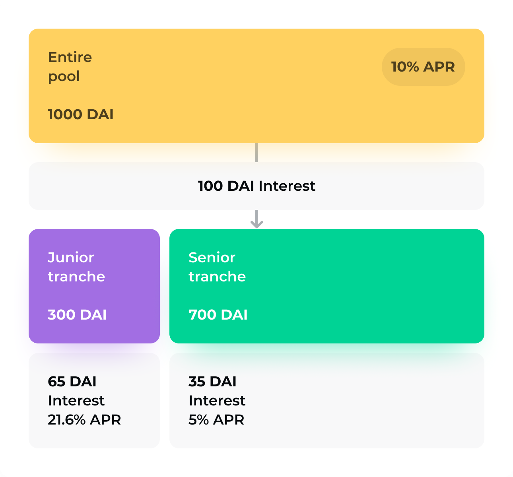
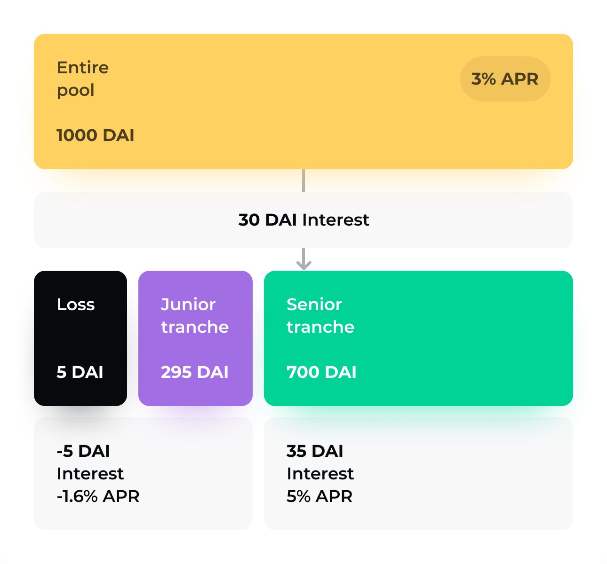

# **BarnBridge Litepaper** 

## Context

While interest rates plummet, the traditional financial system is experiencing a historic uptick in aggregate debt levels. In the meantime, a new decentralized financial system (short DeFi) is burgeoning in the online economy. Yields on these promising financial instruments continue to dwarf the menial rates offered by comparable products in the legacy financial system. 

DeFI allows the reduction of costly and labor-intensive actions (e.g. custody, settlement, and escrow) within the legacy system to simple algorithmic actions. Moreover, the efficiency and flexibility of smart contracts and DAO technologies allow for far more complex derivative instruments to be built and provide a level of transparency and security unfathomable to current financial networks. 
Since these efficiencies are coupled with higher perceived risk, heightened yields are attainable despite the growth of debt levels, referred to as “Total Value Locked” (TVL), to over $40 billion. As has historically been the case, we are seeing working capital following higher yields. Therefore, we strongly anticipate that the trend toward DeFi will continue

**BarnBridge exists to help facilitate this transition and make the decentralized financial system more efficient, risk-flexible, and attractive to a wider range of participants.**

At this point, over 99.9% of global debt is still structured via legacy financial systems, starving for yield. This is because no sophisticated debt investor is taking on the risk associated with cryptocurrencies today, nor will they have the resources for implementing the smart contracts alluded to above.

**Our goal with BarnBridge is to automate the structuring of risk-minimized debt instruments within the DeFi ecosystem to bridge the gap between traditional investors and this innovative space.**

## BarnBridge

BarnBridge smooths out the risk curve associated with digital assets and DeFi debt products by allowing users to tokenize derivatives. Its applications are able to take an underlying asset or financial instrument and program rules to allocate returns or losses to holders of different tranches of the derivative. This is coordinated through tradable tokens.

To start, BarnBridge applications will offer this functionality for yield sensitivity and asset price fluctuations. The protocol aims to be agnostic toward both blockchain platforms and crypto-assets. 

Its first application, **SMART Yield**, is available to users today. It builds on top of existing protocols in the DeFi ecosystem, like Compound Finance and AAVE, to take their variable rate annuities and structure fixed income products.

This allows BarnBridge to pool yields from numerous DeFi protocols to create more efficient markets and smooth out the yield curve across the entire industry. While we expect singular lending protocols to introduce fixed income products themselves, we believe that this cross-protocol approach will result in greater efficiencies by properly spreading risk across the market. 

BarnBridge itself does not lend money directly off of its platform. Rather, pooled collateral is deposited into lending protocols or yield generating contracts. The yield is then divided between different tokenized tranches. 

A user can buy exposure to the most senior tranche of a given derivative, for example, and get a lower-than-market yield but have it be fixed. SMART Yield bonds are thus a way to buy and sell risk on yield with pricing driven purely by the market.

### Scenario 1

### Scenario 2

Its second application, **SMART Alpha**, will offer market price exposure risk mitigation via tranched volatility derivatives.  That is to say, it will allow users to select from various levels of price exposure. The idea is that every tranche of price exposure does not need to experience the same upside or downside volatility with a given move in the price of the underlying asset.

For example, if the current price of 1 ETH is $1000, and the price was to move to $900, the riskiest tranche (i.e., the “junior”) would bear the majority of the $100 loss. The less risky (i.e., the “mezzanine” and the “senior”) taking less to none of the loss.

Such gains and losses can be measured and allocated across tranches algorithmically with smart contracts, and the tranches themselves can be traded as unique digital assets.

## Governance
BarnBridge is undergoing a transition of power away from the core team to a decentralized community of users and developers who will govern its further evolution (i.e., a “DAO”). The DAO will own the system’s core contracts and will be able to define what these contracts are able to do.

The architecture utilizes the [Diamond Standard (EIP-2535)](https://eips.ethereum.org/EIPS/eip-2535), which allows for smart contracts to add, upgrade, or remove functionality. Moreover, the DAO is the recipient of the fees charged by BarnBridge applications. Currently, SMART Yield charges junior tranches 0.5% of principal upon deposit, and 5% of profits on senior tranches.

This DAO is governed by the $BOND token. Holders can vote on any matter of upgrades, including everything from software-related updates to funding individuals or other companies to work on behalf of the protocol. 

10,000,000 of these tokens were initially minted, and the ability to mint more has been removed; 2,200,000 have been reserved for founding team members, seed investors, and advisors, and are currently vesting over a two-year period.

Another 1,500,000 have already been distributed to community participants, and the remainder resides in the DAO treasury as funds to be allocated for the further development of BarnBridge. The $BOND token is not required for the use of BarnBridge applications, as its primary purpose is to coordinate stakeholders.

## What's Next?

* [Get Started with BarnBridge](https://docs.barnbridge.com/)
* Learn about our [team's background](https://barnbridge.com/team)
* Access our applications at [app.barnbridge.com](https://app.barnbridge.com)
* View our [code audits](https://github.com/BarnBridge/BarnBridge-PM/tree/master/audits)

If you want to stay up to date, visit our [website](https://barnbridge.com/) and follow our official [Twitter](https://twitter.com/barn_bridge). For participating in the conversation around Barnbridge, join our [Discord](https://discord.com/invite/FfEhsVk). Feel free to contact [max.fiege@barnbridge.com](mailto:max.fiege@barnbridge.com) and [pavlo@barnbridge.com](mailto:pavlo@barnbridge.com) for further questions.