# **Ein Protokoll zur Risiko-Tokenisierung**

#### Ein Fluctuations-Derivatives-Protokoll für das Hedging von Marktpreis und Yield-Sensitivität

## Abstract

BarnBridge ist eine Idee und ein Whitepaper, die ursprünglich im zweiten Quartal 2019 konzipiert wurden. Zu dieser Zeit rutschte MakerDAO, in Mainstream-Blickfeld und begann die Vorstellungskraft der heutigen DeFi-Community (Decentralized Finance Community) zu wecken. Heute, mehr als ein Jahr später, erzielen 60% der globalen Schulden nur noch weniger als 1% und über 15 Billionen USD Wert an globalen Schulden erzielt sogar negative Zinssätze. Das Kapital bewegt sich deshalb stärker hin zu Anlageformen mit höherem Risiko und höheren Renditen. Dies ist kein Zufall oder Trend. Historisch gesehen reicht die Jagd des Kapitals nach höherer Rendite bei gleichbleibendem Risiko bis in biblische Zeiten zurück.
Die weltweite Beschleunigung der Verschuldung war bereits vor der durch Covid-19 verursachten Finanzkrise im Gange. Im ersten Quartal 2020 stieg die weltweite Verschuldung auf 258 Billionen USD. Diese Zahl liegt laut IIF, das globale Banken und Finanzinstitute repräsentiert, 331% über dem globalen BIP. Da die Federal Reserve unter dem Vorwand operiert, über ein unendliches Bargeldangebot zu verfügen, und der Euphemismus „Money Printer Go Brrrr“ im Mainstream Sprachgebrauch angekommen ist, ist es ziemlich klar, dass diese Zahlen wahrscheinlich steigen und  sich das Verhältnis von Schulden zu BIP weiter verschärfen wird.

Das traditionelle Finanzsystem, in diesem Dokument mit TradFi bezeichnet, erlebt einen historischen Anstieg der Gesamtverschuldung, während Rendite und Zinssätze sinken. Währenddessen hat sich ein dezentrales Finanzsystem entwickelt, das in diesem Dokument als DeFi bezeichnet wird. In diesem System blüht der Handel mit mit digitalen Assets und Cryptowährungen auf. Während die Verschuldung, die als in dezentralen Protokollen als TVL (total value locked) bezeichnet wird, von Hunderten Millionen im letzten Jahr auf Milliarden Dollar im Jahr 2020 gestiegen ist, stellt die Rendite dieser Instrumente die von vergleichbaren Produkten im alten TradFi System angebotenen niedrigen Zinssätze weiterhin in den Schatten. Umgekehrt ist die jährliche prozentuale Rendite (APY) bei dezentralen Protokollen aufgrund des angenommenen höheren Risikos und der höheren Effizienz von Smart-Contract-Technologie weitaus höher als im traditionellen Finanzsystem. Das liquide Kapital folgt dem historischen Trend, höheren Renditen zu folgen, weshalb TVL immer schneller zu DeFi wandert. Dies ist ein Trend, der sich fortsetzen wird.

Der Bedarf nach vertrauten TradFi-Instrumenten im DeFi-Ökosystem war noch nie so groß wie jetzt. **BarnBridge ist eine Idee, deren Zeit gekommen ist.**

## DeFi Primer: Risk Ramps und TradFi-Brücken

Die Yield-Produkte auf den dezentralen Märkten, die einen höheren APY erzielen als die Produkte auf den traditionellen Märkten, sind derzeit mit Crypto-Assets besicherte Kredite. Anstatt Crypto für Fiat zu verkaufen, setzen Kreditnehmer digitale Assets als Sicherheit ein und erhalten dafür andere digitale Assets. Während es sich bei diesen Darlehen bisher hauptsächlich um kurzfristige Darlehen an Trader handelte, hat sich das System als effizient und bereit zur Expansion erwiesen. Die erzielten Effizienzsteigerungen werden unweigerlich höhere Kredite mit längerer Laufzeit auf Distributed Ledgers ziehen. Die genannten Effizienzvorteile werden durch die Fähigkeit von Smart Contracts ermöglicht, digitales Collateral zu verwahren, bis beide Seiten der Transaktion ihre Verpflichtungen entsprechend des programmierten Algorithmus erfüllt haben. Die Umstellung von Custody, Settlement und Treuhandverfahren - alles arbeitsintensive, kostspielige Aktionen innerhalb des alten Systems - auf algorithmische Verfahren, reduziert die Kosten, die bisher für die Durchführung dieser Aktionen berechnet werden erheblich. Diese Effizienzsteigerungen in Verbindung mit einem höheren wahrgenommenen Risiko sind der Grund, warum die Erträge bei dezentralen Systemen höher sind. Wenn sich das Risiko in DeFi dem wahrgenommenen Risiko in TradFi annähert, indem beispielsweise Hypothekarkredite zu DeFi abwandern, wird die besondere Effizienz von Smart Contracts weiterhin eine höhere Rendite für dezentrale Systeme ermöglichen als traditionelle zentralisierte Systeme.

Darüber hinaus ermöglicht die Effizienz von Smart Contracts und DAO-Technologien den Aufbau weitaus komplexerer Derivate und bietet ein Maß an Transparenz und Sicherheit, das für aktuelle Finanznetzwerke unerreichbar ist.

Alle diese Effizienzvorteile werden derzeit durch cryptobesicherten Krediten erzielt und bauen auf ihnen auf.

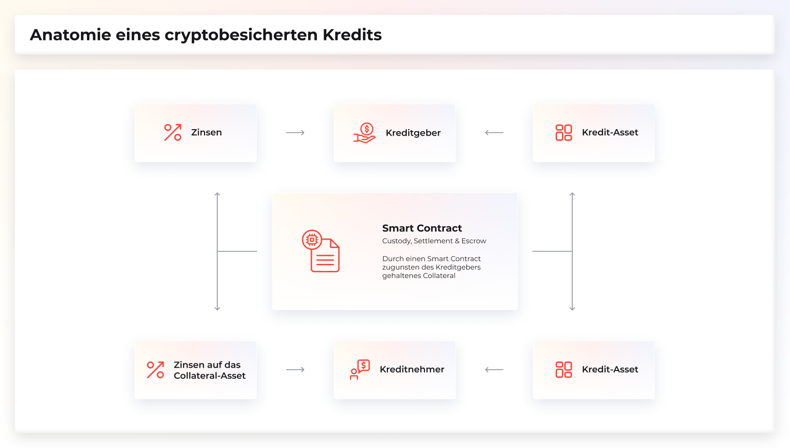

Wie bereits erwähnt, sollten diese Effizienzgewinne über einen längeren Zeitraum gesehen auf Hypothekenschulden und Unternehmensschulden übertragbar sein, wenn diese auf dezentrale Plattformen verlagert werden. Dies sollte auch komplexere kreditbasierte Derivatinstrumente der Grundlage von Verschuldung und Rendite dazu bringen, auf dezentrale Plattformen umzusteigen. Es wird möglich sein, weitaus komplexere Derivate zu strukturieren und sie mit weitaus größerer Effizienz und Transparenz zu verwalten, als das vor den Innovationen von Blockchain, Cryptowährung, Smart Contracts und dezentralen autonomen Organisationen (DAOs) der Fall war. Schulden- und yieldbasierte Derivate in Höhe von 244 Billionen USD werden im Laufe der Zeit immer mehr auf effizientere Technologien abwandern. Die Migration von Yield und yieldbasierten Derivaten von weniger effizienten zentralisierten Finanzsystemen zu effizienteren dezentralisierten Finanzsystemen wird eine der größten Vermögensbewegungen in der Geschichte der Menschheit sein. **BarnBridge soll diesen Übergang erleichtern und das dezentrale Finanzsystem effizienter, risikoflexibler und für ein breiteres Spektrum von Teilnehmern attraktiver machen.**

Es gibt einen riesigen Markt für Menschen, die sich mit Crypto beschäftigen möchten aber (1) nicht die gesamte Risikokurve des Besitzens, Verleihens oder Empfangens eines digitalen Assets tragen möchten und (2) sich niemals die Zeit nehmen werden, eine DAO zur Erstellung eines Smart Contracts zu nutzen, der beide Seiten des Darlehens oder der Vereinbarung algorithmisch erfasst. Über 99,9% der globalen Schulden werden immer noch über traditionelle Märkte strukturiert und hungern nach Rendite. Umgekehrt haben fortgeschrittenere Finanzunternehmen keine Risikotoleranzen. Dies ermöglicht es die Yield-Kurve unterschiedlich zu strukturieren. Die Risikofreudigsten (wahrscheinlich Hedge-Fonds) möchten die kleinsten Beträge mit der höchsten Rendite für ihre Wette/Hedge einsetzen. Im Gegensatz dazu sind konservativere Anleger häufig bereit, einen großen Teil ihrer Upside aufzugeben, um Zugang zu risikoärmeren Instrumenten zu erhalten. „Riskless“-Produkte, wie tradFi sie nennt, werden derzeit in DeFi nicht angeboten. Die Möglichkeit, Instrumente auf diese Weise zu strukturieren, ermöglicht es risikoaverseren Anlegern der traditionellen Märkte, in die dezentralen Märkte einzusteigen.

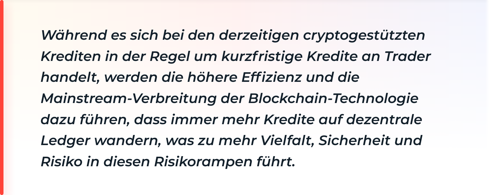

Kurzfristig (DeFi) und mittelfristig (Proof of Stake) werden Risikorampen weiterhin Märkte für traditionelle Investmentunternehmen schaffen, die „mit Null aussteigen“ oder „über 1% kommen“ wollen. Durch diesen Prozess werden immer mehr Arten von Darlehen zu Decentralized Ledgers verschoben. Auf lange Sicht und teilweise durch diesen Prozess, werden Kreditgeber und Kreditnehmer verstehen, warum dezentrale und vertrauenswürdige Intermediaries den derzeitigen Mittelsmännern überlegen und zusätzlich kostengünstiger sind. Auf diese Weise werden größere Teile der globalen Schulden in Höhe von 244 Billionen USD auf die Blockchain wandern, was die Möglichkeit für mehr Rendite, mehr Risikorampen und höhere CD-ähnliche Produkte (Collateralized Debt) für Fiat- und Crypto-Anleger der neuen Geschäftsbanken & Finanzmärkte schafft.

## 1. Fluctuation Derivatives Protokoll

BarnBridge ist das erste Protokoll für Fluktuationsderivate. Vor dem Aufkommen der Smart Contract Technologie war es nahezu unmöglich, die Rendite einer verteilten Kapitalallokation vertrauenswürdig und transparent zu tracken und zuzuordnen, um sich gegen alle Arten von Schwankungen abzusichern. Konzeptionell gesehen kann man Derivate für jede Art von marktbedingten Schwankungen bauen, um verschiedene Risiken abzusichern. Beispiele hierfür sind, ohne Anspruch auf Vollständigkeit, Zinssensitivität, Schwankungen des zugrunde liegenden Marktpreises, Schwankungen der prognostizierten Marktquoten, Schwankungen der Ausfallraten bei Hypotheken, Schwankungen der Rohstoffpreise und eine scheinbar unendliche Anzahl marktbasierter Schwankungen zur Absicherung einer bestimmten Position.

Wir planen, das erste plattformübergreifende Derivatprotokoll für alle Arten von Schwankungen zu entwickeln. Zunächst konzentrieren wir uns auf Yield Sensitivity und Marktpreis. Downstream planen wir die Einführung einer weitaus größeren Vielfalt von Absicherungen gegen Schwankungen im dezentralen Ökosystem. BarnBridge zielt darauf ab, plattform- und assetunabhängig zu sein.

Man kann das Risiko von digitalen Assets und Yield Sensitivity für digitale Assets verringern, indem man sie in im Wesentlichen unendlich viele, separate, auf US-Dollar denominierte Teile oder Tranchen aufspaltet und aus diesen Tranchen Derivate aufbaut. BarnBridge zielt darauf ab, die Risikokurve zu glätten und sowohl DeFi- als auch TradFi-Anlegern ein mehrschichtiges Risikomanagement anzubieten, indem effizientere auf Schulden und Renditen basierende Derivate bereitgestellt werden.

## 2. Initial Product Offerings

SMART $BONDS - **S**tructured **M**arket **A**djusted **R**isk **T**ranches

## 2.1 SMART Yield Bonds

Reduzierung des Zinsvolatilitätsrisikos durch schuldenbasierte Derivate.

Derzeit bietet das dezentrale Finanzsystem hauptsächlich variabel verzinsliche Annuitäten an. Die Möglichkeit, die Rendite in feste Zinssätze zu strukturieren, in Form von

However, the ability to structure yield into fixed rates will come in the form of locked collateral with a maturity on repayments, or bonds, as well as fixed rate yields with no maturity, or annuities.

Wir glauben nicht, dass dies eine neuartige Idee ist, und wir glauben natürlich, dass diese Art von Produkten im Laufe der Zeit auch in DeFi existieren wird. Die verschiedenen Varianten von Derivaten und die Reduzierung der Komplexität in der Finanzplanung, die man erreichen kann, wenn Smart Contracts Rendite abwerfen, werden aus sicht der traditionellen Finanzmärkte jedoch sehr beeindruckend sein.

Dezentrale Finanzinstrumente zeigen die Kraft, die eine vertrauenswürdige Finanzindustrie entwickeln kann. Powerhouse-Projekte im DeFi-Bereich wie MakerDAO, Synthetix, AAVE, Compound, Curve und andere erzielen Erträge für Benutzer, die keine der Einschränkungen und des Rent-Seeking von tradFi-Instrumenten haben, indem sie Buchhalter, Treuhandkonto und verschiedene Overhead-Kosten durch Algorithmen, trustless Oracles und dezentrale Ledger ersetzen. Auf zahlreichen dezentralen Plattformen sind unterschiedliche marktgetriebene Renditen zu finden, aber es gibt nichts, was die verschiedenen dezentralen Protokolle bedient und zusammenführt und eine normalisierte Risikokurve bereitstellt, sowie Derivate zur Risikominderung anbietet.

Darüber hinaus gibt es auf den aktuellen DeFi-Märkten keine Effizienz über Lending-Protokolle hinweg. Die Fähigkeit, Rendite aus zahlreichen Protokollen zu ziehen und sie in höhere und niedrigere Renditebereiche umzuwandeln, ist auf den traditionellen Finanzmärkten zwar vorhanden, auf den dezentralen Finanzmärkten jedoch effizienter, wenn ein akzeptables Maß an Liquidität vorausgesetzt wird.

Unsere erstes strukturiertes Produkt ermöglicht es DeFi-Benutzern nicht nur, Zugang zu fixen Erträgen zu erhalten, sondern bündelt auch die Erträge aus zahlreichen Protokollen im gesamten Ökosystem, wodurch wiederum ein effizienterer Markt geschaffen wird, der die Ertragskurve in der gesamten Branche glättet.

Während wir durchaus erwarten, dass einzelne Lending-Protokolle Konzepte für festverzinsliche Wertpapiere auf ihren Plattformen einführen, besteht eine wesentliche Differenzierung eines protokollübergreifenden Ansatzes für festverzinsliche Wertpapiere durch diversifizierte Assets und dem diversifiziertes Plattformrisiko. Durch die algorithmische Bündelung von verzinslichen digitalen Assets auf einer Reihe von Lending-Plattformen werden wir durch Risikoverteilung und Normalisierung der Risikokurve der gesamten Branche eine höhere Effizienz erzielen. Da BarnBridge kein Geld direkt von einer nativen Plattform ausleiht und stattdessen Kredite in der gesamten Branche poolt, können wir plattformagnostisch und agnostisch gegenüber einzelnen digitalen Assets bleiben, was downstream wiederum komplexere Strukturierungs- und Bond-Ratingsysteme ermöglicht.

**Risiko- und Verlustszenarien.**

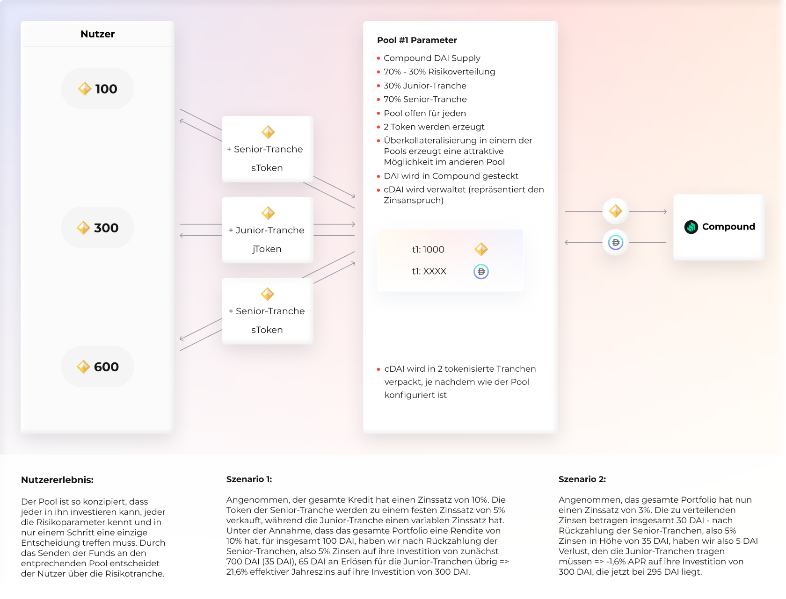

**Szenario 1:**

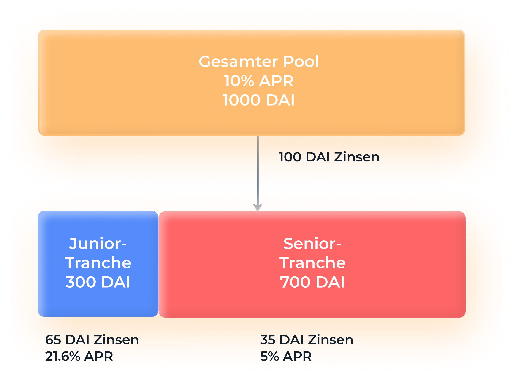

**Szenario 2:**

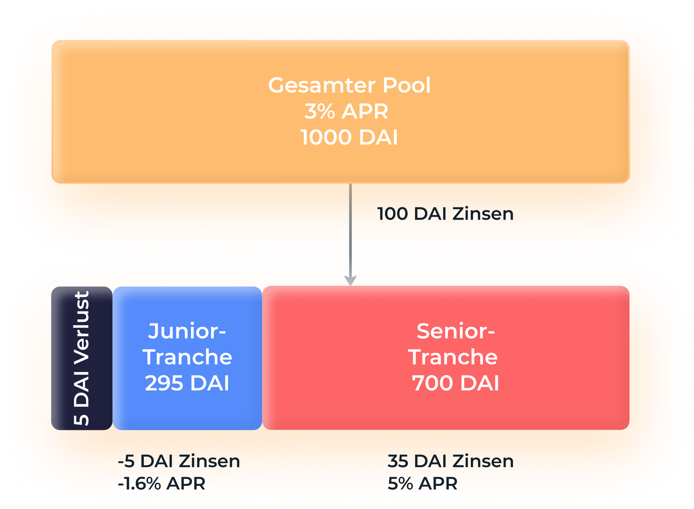

Gepoolte Sicherheiten werden in Lending-Protokollen oder renditegenerierenden Smart Contracts hinterlegt, und die Rendite wird in verschiedene Tranchen gebündelt und tokenisiert. Man kann also Exposure in der höchsten Tranche kaufen und eine niedrigere Rendite erzielen, aber ein viel geringeres Risikoprofil haben. SMART-Bonds sind eine Möglichkeit, Yield-Risiko zu kaufen und zu verkaufen, wobei alle Preise ausschließlich vom Markt bestimmt werden.

[Mögliche Strukturierungsmodelle sind hier zu finden](Https://docs.google.com/spreadsheets/d/157p5D_E_j_zYwc_QzHmVeJH_L64HubkXDPdMwVUkypY/edit#gid=2024388043)

## 2.2 SMART Alpha Bonds

Reduzierung des Marktpreisrisikos durch tranchierte Volatilitätsderivate.

Die SMART Alpha-Bonds werden nicht über traditionelle Yield-Tranchen strukturiert, sondern mit verschiedenen Marktpreisrisiken, die wir als Risikorampen bezeichnen. Die Idee ist, dass nicht jeder Bucket oder jede Tranche des Preisrisikos über die gesamte Risikokurve hinweg gleich sein muss. Das bedeutet, dass die ersten 100 USD des Preisrisikos nicht die gleiche Aufwärts- und Abwärtsvolatilität haben müssen. **Dies ist vergleichbar mit Fractional Ownership, jedoch mit einem unterschiedlichen Risiko/Ertrag-Verhältnis für die Teile.**

Wenn zum Beispiel der aktuelle Preis von 1 ETH voraussichtlich 1000 USD beträgt und auf 900 USD fällt, trägt die erste Tranche (oder die riskantesten Tranchen) einen höheren Prozentsatz des Verlustes. Umgekehrt, wenn der aktuelle Preis von 1 ETH 1000 USD beträgt und auf 1100 USD steigt, streicht die erste Tranche (oder die riskantesten Tranchen) einen höheren Prozentsatz des Gewinns ein.

Wie diese Gewinne und Verluste gemessen und auf Tranchen verteilt werden, kann mit Smart Contracts algorithmisch ermittelt werden. Jede Tranche kann als eigener digitaler Vermögenswert gehandelt werden. Zum Beispiel jETH (eine Junior-Tranche des ETH-Preisrisikos), mETH (eine Mezzanine-Tranche des ETH-Preisrisikos) und sETH (eine Senior-Tranche des ETH-Preisrisikos). Die Tranchen werden als Risikorampen dienen, in denen Benutzer mit unterschiedlichem Risikoappetit ihr passendes Produkt und Exposure gegenüber digitalen Assets finden können.

Mit dem SMART Alpha-Produkt können Tranchen von Pools mit einzelnen oder mehreren Assets aufgebaut werden, die mit geringerem Risiko niedrigere Renditen erzielen, wenn die zugrunde liegenden Vermögenswerte steigen, und geringere Verluste erleiden, wenn sie fallen. 
However, we can build this without needing yield attached at all. The opportunity for downstream opportunities to use various risk ramps for differing collateral obligations is a logical progression these risk ramps will create.

#### 2.3 UI/UX Interface (Light) 

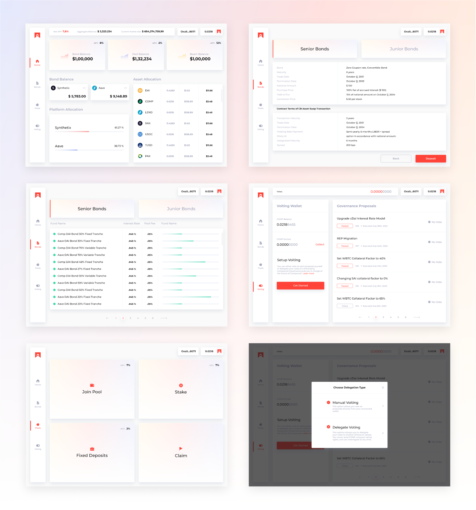

#### 2.4 UI/UX Interface (Dark) 

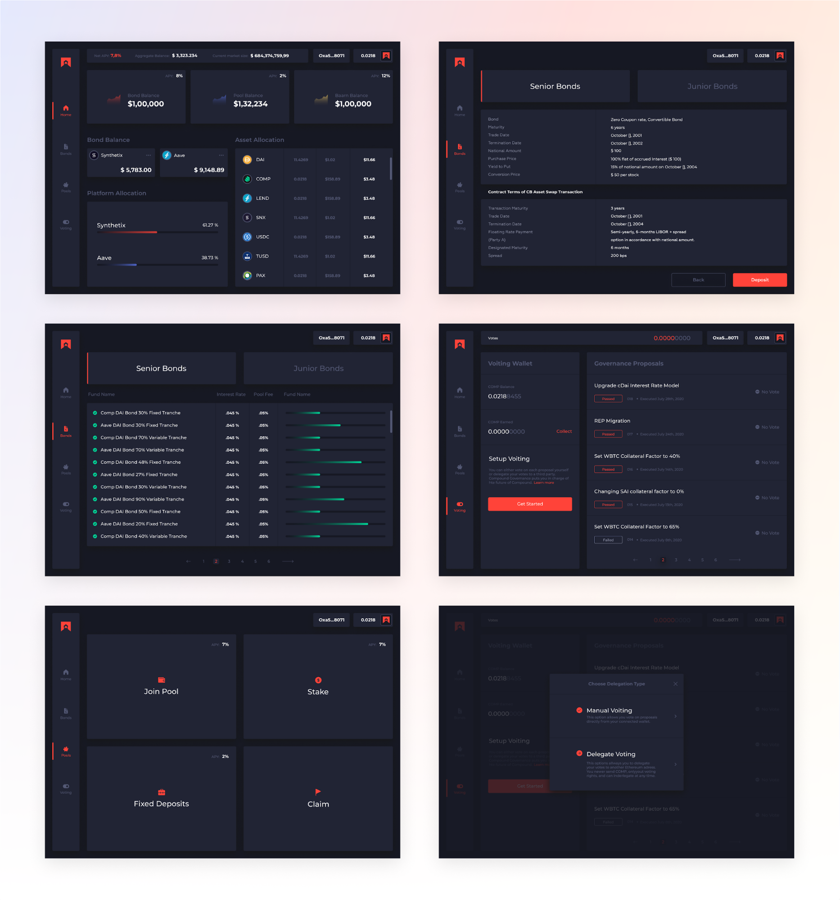

## 3. Token - $BOND

BOND ist ein ERC-20-Token. Er wird verwendet, um zu im BarnBridge-System zu staken, und als Governance-Token, wenn das Governance-Modul aktiviert wird. Da er dem ERC-20-Standard entspricht, kann der $BOND-Token an jeder Exchange gehandelt und in jeder Wallet verwaltet werden, sodass weltweiter Zugang gewährleistet ist.

### 3.1 Distribution

Die Verteilung der Token wurde mit dem Ziel gestaltet, das Protokoll möglichst dezentral zu halten und sicherzustellen, dass die Macht nicht in der Hand einiger weniger liegt.

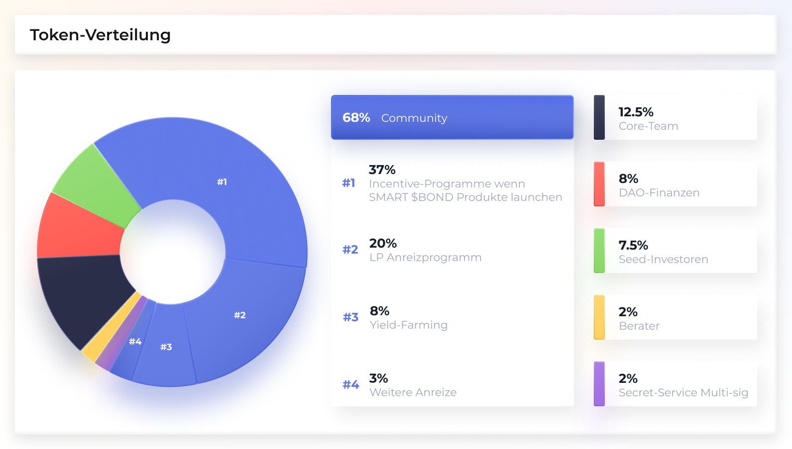

#### 3.1.1 Fair Vesting

Der Vesting-Zeitplan ist so konzipiert, dass nicht ständig ein Damokles-Schwert über den Köpfen der Benutzer schwebt. Die den Foundern, Seed-Investoren und Beratern zugewiesenen Token sind an einen Smart Contract gebunden, der die Token linear über einen Zeitraum von zwei Jahren jeweils wöchentlich freigibt. Das Vesting beginnt mit dem Start des Yield Farming-Mechanismus. 

Es ergibt sich folgende Verteilung:

- Gesamtmenge der BOND-Token: 10.000.000
- Prozentsatz der BOND-Token, die Foundern, Seed-Investoren und Beratern zugewiesen wurden: 22%
- Gesamtbetrag der gevesteten BOND-Token: 2.200.000
- Vesting-Zeitraum: 100 Wochen
- Release-Zyklus: 1 Woche
- Anzahl der wöchentlich freigegebenen $BOND-Token: 22.000
- Prozent der wöchentlich freigegebenen $BOND-Token: 0,22%

### 3.2 Governance

Der $BOND-Token ist der Governance-Token des BarnBridge-Systems, mit dem $BOND-Besitzer über Aktualisierungen der Plattform abstimmen können. Durch die Kombination von Governance-Mechanismen und Anreizen für die Halter wird der Token als Medium zur Abstimmung der verschiedenen Stakeholder im System dienen. $BOND wird auch dazu Sicherheitsbelange und Strategie des Protokolls zu steuern. Dezentrale, automatisierte Governance, die Anreize für die Teilnehmer bietet und auf Sicherheit, Nachhaltigkeit und das Wohl der Teilnehmer abzielt, ist der Schlüssel zum Erfolg eines DeFi-Protokolls.

#### 3.2.1 DAO First Approach

BarnBridge verfolgt einen „DAO First Approach“, um das Protokoll hochzufahren, und entscheidet sich von Anfang an für die Verwendung dezentraler Tools, um das finale Ziel der vollständigen Dezentralisierung zu erreichen. Auf diese Weise wird ein flexibles Smart Contract System entstehen, mit dem Funktionen basierend auf DAO-Proposals hinzugefügt / aktualisiert / entfernt werden können. Es wird eine Inkubator-DAO namens Launch DAO geben und etwas später die finale Protokoll-DAO mit dem Namen BarnBridge DAO.

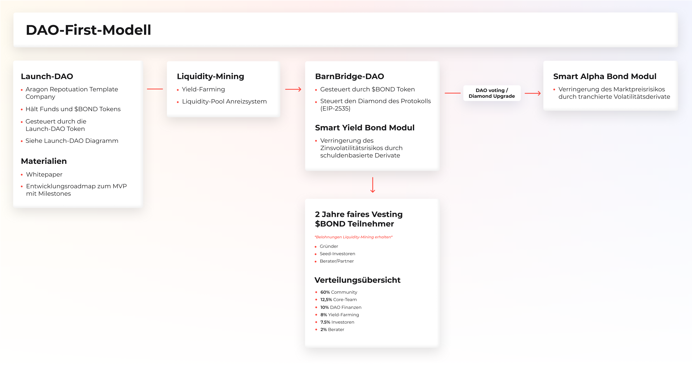

#### **Launch DAO**

Beginnend mit der Launch DAO verwenden die Founder, Seed-Investoren und Berater ein Aragon DAO Company Template, das übertragbare Token verwendet, um die Eigentumsanteile abzubilden. Entscheidungen werden auf der Grundlage einer anteilsbasierten Abstimmung getroffen. Der native Token der Launch DAO ist $BBVOTE. Die Founder erhalten 45%, die Seed-Investoren 45% und die Berater 10%. Das Quorum für ein Proposal wird auf 62% festgelegt, was bedeutet, dass mehr als 62% der stimmberechtigten Anteile an einer Abstimmung teilnehmen müssen. Das Minimum wird auf 62% festgelegt, was bedeutet, dass ein Vorschlag, um angenommen zu werden, von mindestens 62% der Anteile unterstützt werden muss.

Die Geldmittel der Seed-Investoren und der anfängliche Supply des $BOND-Tokens werden in der Launch DAO Treasury gehalten. Die Launch DAO wird auch das Aragon Agent Modul aktiviert haben, und wir werden eventuell Uniswap und Balancer Pool Schnittstellen mit der DAO entwickeln.

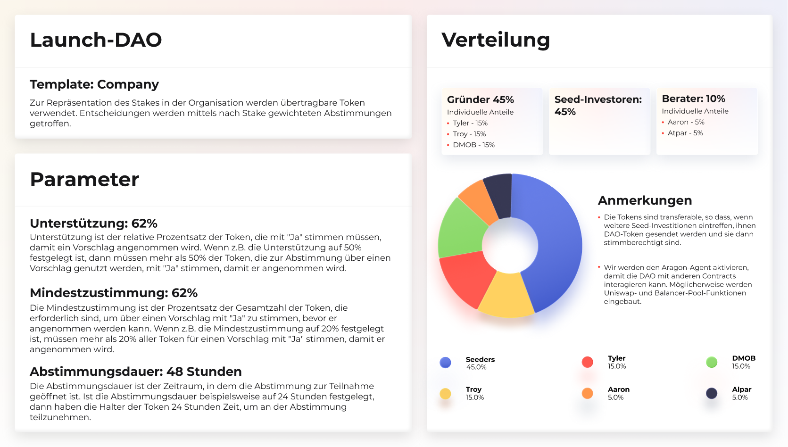

#### **BarnBridge DAO**

Die BarnBridge DAO wird von der $BOND-Community gesteuert werden. Die BarnBridge DAO hat die volle Kontrolle über das Protokoll und die darin enthaltenen Features. Wir konzipieren die DAO mithilfe des [Diamond Standard (EIP-2535)](https://eips.ethereum.org/EIPS/eip-2535), mit dessen Hilfe wir das Protokoll aktualisieren können, ohne dass alle Mitglieder ihre Token herausziehen und zu einer zweiten Version des Protokolls wechseln müssen, wenn es soweit ist. Die BarnBridge DAO hat die volle Kontrolle über den Diamond, was eine besondere Flexibilität im WEB3-Space ermöglicht. Dies wird im Abschnitt Smart Contracts (4.2.1) näher erläutert.

## 4. Arbeitsumfang

### 4.1 Einführung in die Entwicklung

Der folgende Abschnitt beschreibt die MVP / Beta-Version des Produkts, die dazu beiträgt, die zukünftige Richtung der Produktentwicklung zu bestimmen, Daten zu sammeln und sicherzustellen, dass das Produkt den Marktanforderungen entspricht.

Wir sind fest entschlossen, den Benutzern hervorragende User Experience zu bieten und sicherzustellen, dass frühere Pools sichtbar bleiben und unsere Community fundierte Entscheidungen darüber treffen kann, wann und wie sie teilnehmen möchten. Wir glauben jedoch, dass die Community einige der dazugehörigen Analyse-Werkzeuge erstellen wird, die das Kernprodukt ergänzen werden. Wir begrüßen eine solche Entwicklung, da sie zu tieferen Einblicken in das Produkt führt.

### 4.2 Komponenten und Timeline

#### **Launch DAO**

Wir werden die Community-Contracts, die auf der Aragon DAO Company Template basieren, verwenden um die Core-DAO zu entwickeln. Da die Contracts schon lange in Production genutzt werden, vertrauen wir auf die Funktionalität und die Features, die sie bieten.

Wir erwarten minimale Änderungen am ursprünglichen Quellcode. Wir werden jedoch Tests für unsere häufigsten Anwendungsfälle erstellen, sicherstellen, dass die Workflows sinnvoll sind und die Benutzer eine gute User Experience haben, wenn sie sich der DAO anschließen.

- Geschätzte Zeit zum Entwickeln, Testen und Starten: **Abgeschlossen**

#### **BarnBridge DAO**

Diese nachfolgende DAO muss eventuell bestimmte spezifische Funktionen haben, die die Aragon DAO Company Template noch nicht bereitstellt. Aus diesem Grund werden wir wahrscheinlich ein aktualisierbares Smart Contract-System auswählen (z. B. [EIP-2535](https://eips.ethereum.org/EIPS/eip-2535)), mit dem wir Funktionalität hinzufügen, entfernen und aktualisieren können, so wie es die Community für richtig hält.

Die BarnBridge DAO wird der Kern der BarnBridge-Plattform, da sie in der Lage sein wird, Entscheidungen dezentral zu treffen, um die besten Maßnahmen für das Wohl der Community durchzusetzen.
- Geschätzte Zeit zum Entwickeln, Testen und Starten auf Testnet: **6 Wochen**

Ein zusätzliches externes Audit wird den Start auf Mainnet um ca. **4 Wochen** nach hinten schieben. Weitere Details in Abschnitt 4.2.2 zu Audits & Simulationen.

#### **SMART Yield Bonds**

Das gesamte DAO-Setup ist dazu da, um den Weg zu SMART Yield Bonds zu ebnen. Dies ist das erste DeFi-Produkt der BarnBridge-Plattform. Die Voting DAO wird Pools bereitstellen, denen jeder beitreten kann, der diese Kernfunktionalität nutzen möchte.

Da die DAOs das gesamte System kontrollieren, d.h. die Community entscheidet, wie das System genutzt wird, werden die Parameter für dieses DeFi-Produkt zum Teil von der Community festgelegt. Einige weitere Parameter werden vom dezentralen Oracle-System (wie z.B. Chainlink) bestimmt, welches die richtigen, realen und verfügbaren Parameter festlegen muss, damit die Pools valide sind.

Das System besteht aus Pool-Contracts, mit denen die Benutzer interagieren, den Deployment-Factories, die die Pool-Contracts bereitstellen und einrichten, und dem kostenlosen Back-End und Front-End, das der Community High-Fidelity-UX bietet.
- Geschätzte Zeit zum Entwickeln, Testen und Starten auf Testnet (einschließlich des Oracle-Systems): **12 Wochen**

Ein zusätzliches externes Audit wird den Start auf Mainnet um ca. **6 Wochen** nach hinten schieben. Weitere Details in Abschnitt 4.2.2 zu Audits & Simulationen.

#### **SMART Alpha Bonds**

Nach dem Modell der SMART Yield Bonds steuert die DAO das Setup und die Parameter für SMART Alpha Bonds. Darüber hinaus sind die Smart Contact-Oracle entscheidend für die Bestimmung des Preises der gestakten Assets. Sie bestimmen ebenfalls den Preis zu Beginn der Pool-Periode sowie zum Ende der Periode, um eine faire Verteilung der Gewinne oder Verluste zu erzielen.

Dieses DeFi-Produkt besteht aus den eigentlichen Pool-Contracts, mit denen die Benutzer interagieren, speziellen Deployment-Factories, die die Pool-Contracts erzeugen und einrichten, sowie dem kostenlosen Back-End und Front-End.
- Geschätzte Zeit zum Entwickeln, Testen und Starten: **20 Wochen**

Ein zusätzliches externes Audit wird den Start im Mainnet um ca. **6 Wochen** nach hinten schieben. Weitere Details in Abschnitt 4.2.2 zu Audits & Simulationen.

#### 4.2.1 Smart Contracts

Da wir ein vollständig dezentrales System anstreben, basiert unsere gesamte Infrastruktur auf einer Community-gesteuerten DAO. Die DAO ist Eigentümer der Core-Contracts des Systems und kann definieren, was die Contracts tun können.

Die Architektur verwendet den [Diamond Standard (EIP-2535)](https://eips.ethereum.org/EIPS/eip-2535), mit dem Smart Contract-Funktionen hinzugefügt, aktualisiert oder entfernt werden können. Die Ethereum Smart Contracts sind auf 24 KB maximale Contract-Größe begrenzt. Durch die Nutzung dieses Standards können wir diese Einschränkung jedoch umgehen.

Außerdem kann die BarnBridge DAO entscheiden, welche Funktionen wie geändert werden sollen. Wenn wir z.B. versprechen, dass eine bestimmte Funktionalität zu einem späteren Zeitpunkt aus dem Contract-System entfernt werden soll, können wir den Bytecode entfernen, der diese Funktionalität implementiert. Dies bedeutet, dass kein Risiko besteht, dass dieser Teil der Contracts in Zukunft noch einmal aktiviert wird. Da wir bestimmte Teile der Contracts entfernen können, verhindern wir ein Aufblähen des Systems, sodass es von der Community leicht auditiert werden kann und gleichzeitig flexibler ist.

Dies ist nicht nur eine sehr gute Ergänzung des Tech-Stacks,, sondern wird auch dazu beitragen, das Ethereum-Ökosystem voranzutreiben. Dieses EIP bringt viele Vorteile, nicht nur für unser Protokoll, sondern auch für das Ethereum-Ökosystem als Ganzes.

Um die Kernphilosophie eines vollständig dezentralen Systems beizubehalten, werden wir ein dezentrales Oracle-System wie Chainlink verwenden. Auf diese Weise können Berechnungen off-chain durchgeführt werden, die später in on-chain verwendet werden können. Dies ist nützlich, aber nicht beschränkt auf das Festlegen von Pool-Parametern wie dem Lending-APY. Natürlich kann das Off-Chain-System vom DAO ersetzt und geupgradet werden.

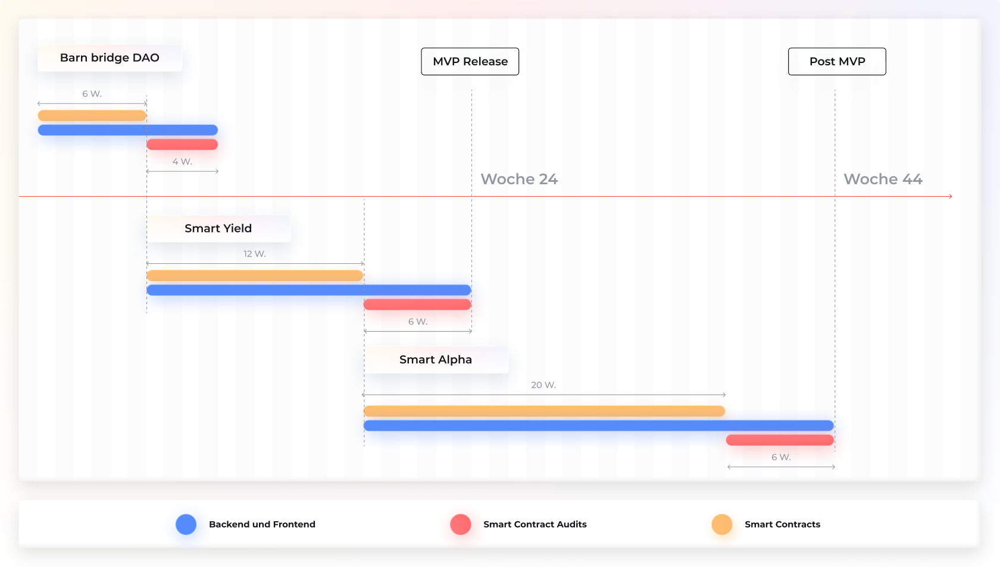

#### 4.2.2 Audit & Simulationen

Um sicherzustellen, dass sich unsere Plattform wie erwartet verhält, werden wir während des gesamten Entwicklungszyklus mehrere interne Audits durchführen. Unser Team kann sicheren Code schreiben, der sich gemäß den Spezifikationen verhält.

Zusätzlich zu den internen Audits werden wir externe Audits mit Top-Unternehmen in diesem Bereich durchführen. Externe Reviews sind eine unabdingbare Voraussetzung, da das Entwicklungsteam zu nahe am Code dran ist, um ihn aus einem neuen Blickwinkel betrachten und Designentscheidungen kritisch zu beurteilen zu können. Ein externes Audit zeigt Inkonsistenzen zwischen Spezifikation und Implementierung auf, stellt sicher, dass die Dokumentation aktuell bleibt, fordert das Sicherheitsmodell der Smart Contracts heraus und sorgt für eine bessere Experience für die Nutzer, die mit den Contracts interagieren.

Zusätzlich zu den Audits werden wir auch agentenbasierte Simulationen durchführen, um verschiedene Szenarien und Benutzerverhalten zu modellieren und zu visualisieren, wie sich das System im Laufe der Zeit entwickelt. Wir können verschiedene Strategien der Benutzer modellieren, die mit unserem System interagieren, und in der Zeit vorspulen, um zu sehen, wie sich die Eigenschaften des Systems dabei ändern.

Wir werden außerdem eine formale Verifikation der Kernfunktionalität durchführen. Die formale Verifikation ist ein teurer und komplexer Prozess, bietet jedoch zusätzliche Sicherheit. Kernkomponenten des Systems werden von unserem Team intern, aber auch von externen Auditoren modelliert und formal verifiziert werden. Es ist wichtig sicherzustellen, dass dies getan wird, da die Asset-Distribution, die interne Buchhaltung, die mathematischen Eigenschaften und die Parameter des Systems für die Sicherheit der Nutzer von entscheidender Bedeutung sind.

## 5 Future Work

#### 5.1.1 Gas Fees

Wenn mehrere Smart-Contract-Operationen mit unterschiedlichen Gas-Kosten erforderlich sind, können sich die Gebühren ziemlich schnell summieren. Es gibt Layer-2-Lösungen, die die Skalierbarkeit erhöhen, komplexe Vorgänge und eine große Anzahl von Transfers ermöglichen und gleichzeitig die damit verbundenen Kosten senken. Eine mögliche Lösung, die Mainnet bereits erreicht hat (wir schauen auf Loopring), sind zk-Rollups, bei denen viele Transfers in einer einzigen Transaktion gebündelt werden. Die meisten Berechnungen werden außerhalb der Blockchain durchgeführt und durch Validity-Proofs gesichert. Wenn man die aufwändigen Berechnungen off-Chain durchführt, wird ein viel höherer Durchsatz möglich, die Kosten werden niedrig gehalten und - ebenso wichtig - die Sicherheit nicht beeinträchtigt. Für eine App, die eine große Anzahl aktiver Benutzer anstrebt, ist eine auf Skalierbarkeit ausgerichtete Lösung der richtige Weg.

#### 5.1.2 SMART Swaps - ein Kredit, aufgeteilt in 4 Instrumente

#### 5.1.3 SMART Prediction Hedge - Derivate zur Absicherung von Schwankungen von Prediction-Markets.

#### 5.1.4 Marktgesteuertes Ratings Oracle - Trestle Point Index

Mithilfe von Wisdom-Of-The-Crowd können wir einen Index erstellen, der als Bewertungssystem fungiert und einen Oracle-Mechanismus bietet, der von jeder Plattform in DeFi verwendet werden kann. Ein Moody's der dezentralen Zukunft, wenn man so will.

Das zur Bewertung der Tranchen verwendete Risikobewertungframework könnte zur Analyse von Marktstimmungen verwendet werden. Angetrieben von den Märkten, die sich hinter den Token-Tranchen bilden, würden die Ratings, die die Tranchenbildung bestimmen, zu einer „Angst-Metrik“. Kurz gesagt, wenn die riskanteren Tranchen beliebter sind, könnte dies ein frühes Anzeichen dafür sein, dass die zugrunde liegenden Komponenten weniger riskant sind. Wenn bei Verwendung sicherer Tranchen mit geringerem Ertrag ein Volumenanstieg zu verzeichnen ist, kann dies ein Frühwarnzeichen dafür sein, dass eine Sicherheitslücke gefunden wurde und ein Angriff möglicherweise unmittelbar bevorsteht.

## 6. Team

### 6.1 Kernteam

- **Troy Murray** - Troy leitet RUDE_labs, eine cryptozentrierte Künstler- und Kunstproduktionsfirma. Troy beschäftigt sich seit 2012, seit er vom Bitcoin Bug befallen wurde, mit den vielen Vorteilen, die Blockchain dem Medienbereich und insbesondere Künstlern bieten kann. Troy hat seitdem im Crypto-Space gearbeitet, wobei die meisten seiner Projekte auf Ethereum basieren. Zuvor arbeitete er an SingularDTV/Breaker und snglsDAO daran, Medien und Unterhaltung zu dezentralisieren. Davor hat er 2016 eine Crowdfunding-Plattform für Titel-III-Aktien mit Ethereum-Token aufgebaut.
- **Tyler Ward** - Tyler betreibt Proof Systems, eines der größten auf digitale Assets spezialisierten Marketing- und UI/UX-Unternehmen. Tyler hat mit ConsenSys, Earn.com (das von Coinbase übernommen wurde), FOAM, Dether & Grid +, Centrality, Sylo (eine dezentrale Messaging-dApp mit 300.000 Benutzern in Neuseeland), NEAR Protocol, DARMA Capital, SingularDTV und dem snglsDAO zusammengearbeitet. Er begann Ende 2016 mit der Arbeit im Crypto-Space und hat zahlreiche E-Commerce-Unternehmen gekauft und verkauft.

***Digital MOB - DigitalMob, ein Softwareentwicklungsunternehmen, mit viel Erfahrung im Aufbau komplexer Blockchain-Produkte, übernimmt die technischen Aufgaben der Produktentwicklung mit einem umfangreichen Team von Web3-Entwicklern, Web- und Mobilentwicklern, Systemarchitekten, Sicherheitsexperten und Analysten.***

- **Milad Mostavi** - Milad ist Mitbegründer und Betreiber von DigitalMOB. Er ist ein erfahrener Softwarearchitekt und hat in den letzten 5 Jahren mit ConsenSys an einem Dutzend verschiedener Projekte gearbeitet. Sein Beitrag war entscheidend für den erfolgreichen Start von SingularDTV und Gnosis und er koordinierte die Entwicklung des dezentralen Unterhaltungsökosystems von SingularDTV.
- **Bogdan Gheorghe** - Bogdan versteht sich als DeFi-Nerd - mit einem Hintergrund in Mathematik und Datenwissenschaften verbrachte er die letzten 2 Jahre bei Alethio mit Datenanalysen zu Blockchain-Daten, wobei er fast alle existierenden DeFi-Protokolle analysierte und verwendete, um DeFi in die Alethio-Produktsuite zu bringen. Da er auch an der Entwicklung und dem Vertrieb der Codefi DeFi-Daten-API beteiligt war, stand er in Kontakt mit den teams aller wichtigen DeFi-Protokolle. Jetzt ist er Teil von Digital MOB und übernimmt die Verantwortung des Produkt-Owners für die Entwicklung von DeFi-Produkten.
- **Dragos Rizescu** - Dragos ist bei Digital MOB für die Produktentwicklung verantwortlich. Sein Hintergrund ist Full-Stack-Entwicklung mit einer Leidenschaft für die Erstellung hoch skalierbarer Benutzeroberflächen. Während der letzten 5 Jahre arbeitete Dragos mit der Avantgarde der Web3-Technologien. Er war Mitbegründer von Treum.io, einer Blockchain-Supply-Chain-Lösung, die Transparenz, Rückverfolgbarkeit und Handelbarkeit für besonders wertvolle physische Vermögenswerte bietet. Als Entwickler war er Teil des Kernteams, um Projekte wie Gnosis und SingularDTV zu launchen, und hat mehrere Projekte im Ökosystem beraten und unterstützt, insbesondere Alethio. Er arbeitete mit ConsenSys zusammen, um den Enterprise-Arm des Unternehmens zu unterstützen. Als Teil des Entwicklungsteams brachte er den ersten nichtfinanziellen Ethereum-Anwendungsfall ein, eine Track & Trace-Lösung für Gesteinsproben für BHP und eine Lösung für dezentrale Energiemärkte mit BP.

### 6.2 Berater / Technologiepartner

- **Aaron McDonald** - Mitbegründer und CEO Aaron ist ein 20-jähriger Veteran der Technologiebranche mit Erfahrung in der Leitung von Teams in allen Bereichen eines Technologieunternehmens, das Portfolios mit einem Wert von über 1 Mrd. USD verwaltet. Aaron gründete Centrality, ein weltweit führendes 100-Millionen-Dollar-Venture-Studio, das ein Venture-Portfolio unterstützt, das dezentrale Technologien nutzt, um neue Marktinnovationen und Kundenerlebnisse zu schaffen. Aaron ist Vorstandsmitglied oder Berater von mehr als einem Dutzend Venture-Unternehmen auf der ganzen Welt. 2018 wurde Aaron als EY-Unternehmer des Jahres für die Kategorie Technologie und aufstrebende Branchen ausgezeichnet.
- **atpar** - das Unternehmen hinter dem ACTUS-Protokoll - dessen Ziel es ist, der Ethereum-Community und der TradFi-Welt die Tools zur Verfügung zu stellen, die zur Erfüllung der Vision eines offenen, interoperablen und reibungslosen Finanzökosystems erforderlich sind. Im Kern nutzt das ACTUS-Protokoll die Algorithmic Contract Types Unified Standard (ACTUS), eine formalisierte Darstellung aller Arten von Finanzverträgen mit Fokus auf die daraus entstehenden finanziellen Verpflichtungen.

## 6.3 Entwicklungsteam
- 1 Projektleiter
- 1 Software-Architekt, QA & DevOps
- 2 Solidity-Entwickler
- 2 Frontend-Entwickler
- 1 Backend-Entwickler

