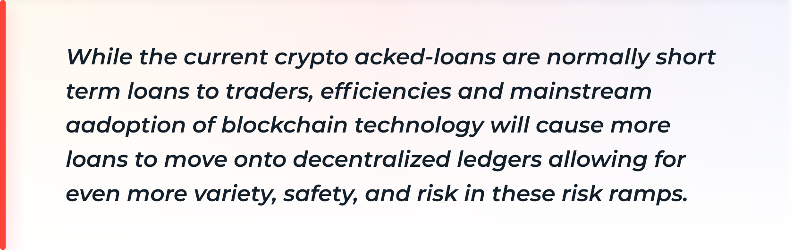
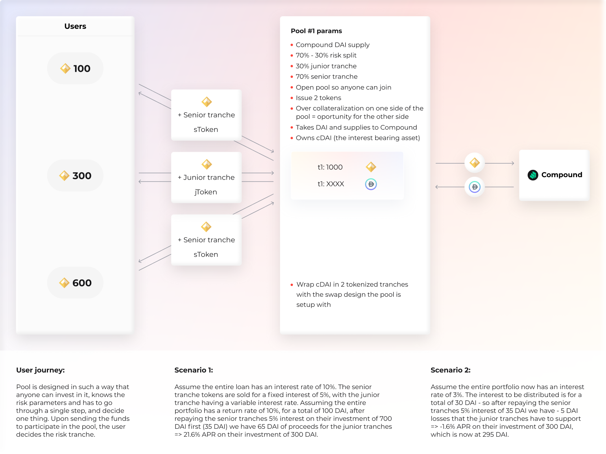
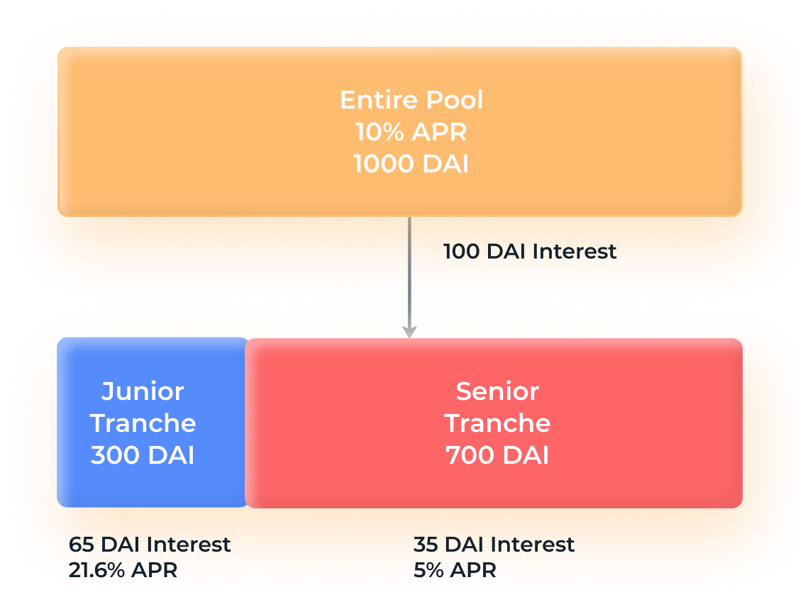
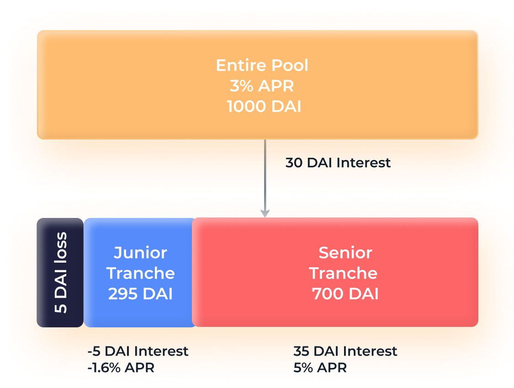
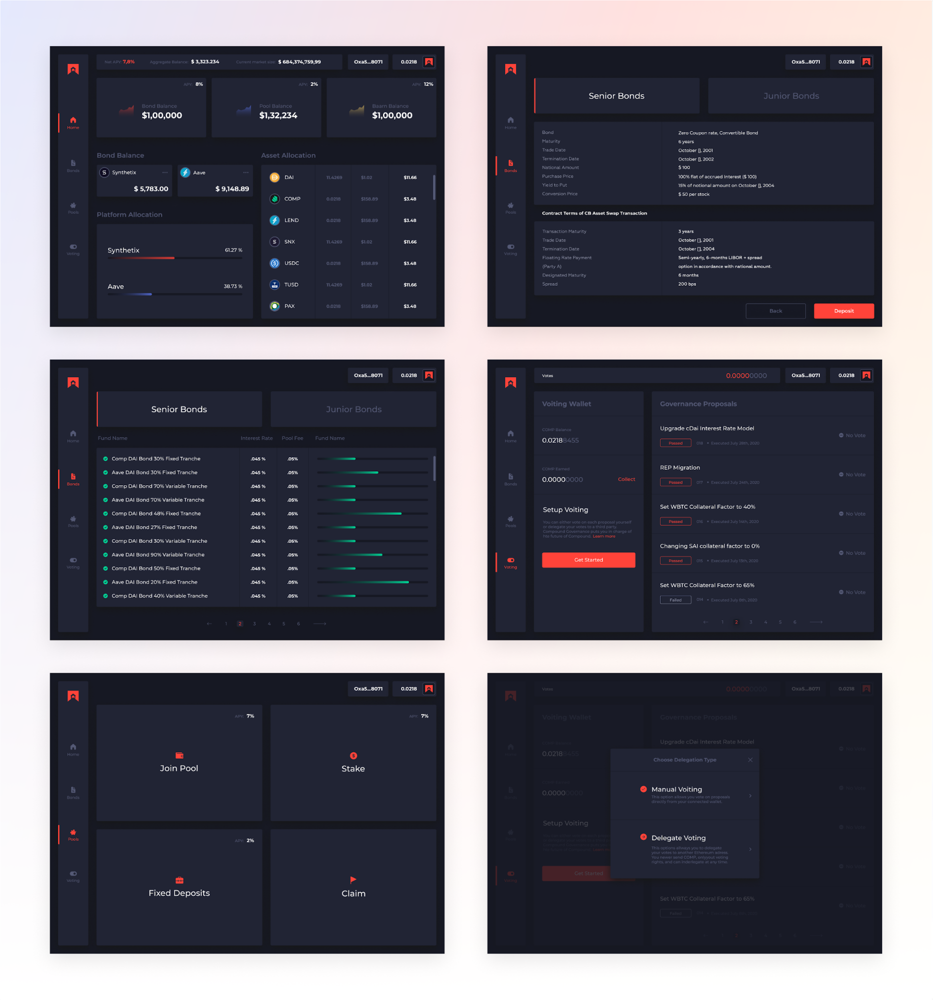
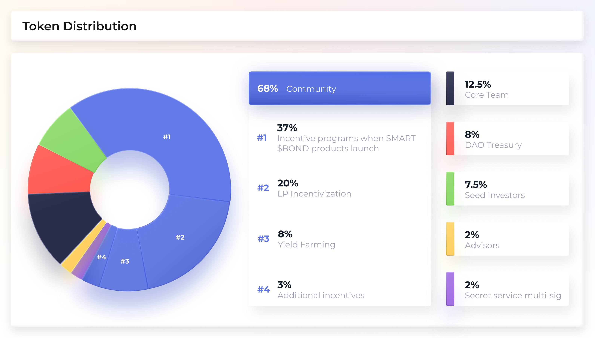
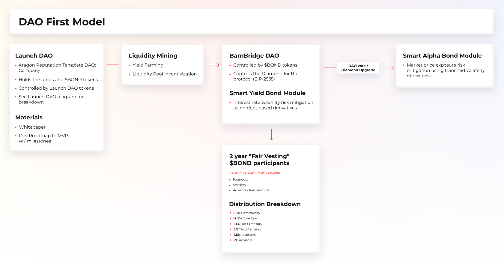
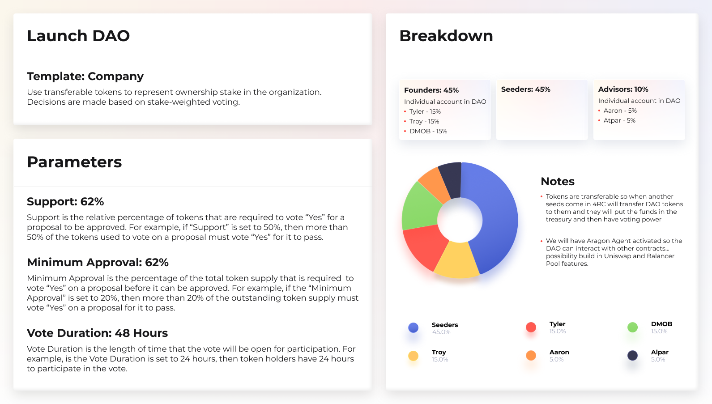
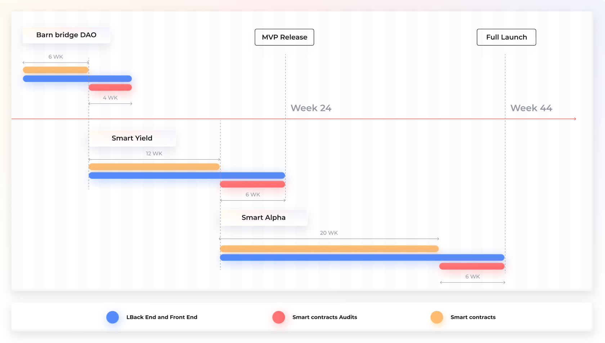

# **Tokenized Risk Protocol** 
#### ***利回り感度と市場価格をヘッジするための変動デリバティブプロトコル.***

## 概要

BarnBridgeは、もともと2019年第2四半期に考案されたアイデアとホワイトペーパーです。当時、MakerDAOは主流の認識を獲得し、現在DeFi（分散型金融）コミュニティとして知られているものの想像力を捉え始めていました。 1年以上後、世界の債務の60％が1％未満、15兆ドルを超える世界の債務がマイナスの利回りを生み出し、資本はリスクの高い利回りの流れに移行し続けています。これは偶然でもトレンドでもありません。歴史的に言えば、聖書の時代にさかのぼると、運転資本は比較的等しいリスクを想定して利回りを追いかけます. 

Covid-19によって引き起こされた金融危機の前に、世界中で債務水準の加速が起こっていました。 2020年第1四半期には、世界の債務は258兆ドルに増加しました。世界の銀行や金融機関を代表するIIFによると、この数字は世界のGDPを331％上回っています。連邦準備制度は、現金が無限に供給されているというふりをして運営されており、婉曲表現の「マネープリンターはbrrrr」が主流の用語集に加わっています。これらの数が増える可能性があり、GDPへの債務発行が加速し続けることは明らかです。. 

この論文でTradFiと呼ばれる従来の金融システムは、利回りと金利が急落する一方で、総債務レベルの歴史的な上昇を経験しています。一方、本書ではDeFiと呼ばれる分散型の金融システムがあり、デジタル資産と暗号通貨でデジタル経済に急成長しています。 TVL、または分散型金融プロトコルに固定された総価値と呼ばれる債務水準は、昨年の数億ドルから2020年には数十億ドルに増加しましたが、これらの商品の利回りは、同等の商品が提供する平均金利を引き続き下回っています。従来のTradFiシステムで。逆に、スマートコントラクトテクノロジーによって提供されるより高い効率と相まって、より高いリスクレベルが想定されるため、年利（APY）は、従来の金融システムで見られるものよりも分散型プロトコルではるかに高くなります。運転資本は、より高い利回りに従うという歴史的な傾向に従っています。そのため、TVLは加速してDeFiに移行しています。これは今後も続く傾向です。

使い慣れたTradFi機器がDeFiエコシステム全体に存在する必要性はかつてないほど高まっています。  **BarnBridgeは、その時が来たアイデアです。** 

## DeFi入門書: リスクランプとTradFiブリッジ

従来の市場の利回り商品よりも高いAPYを生み出している分散型市場の利回り商品は、現在、暗号通貨で裏付けられたローンです。借り手は、暗号通貨をフラットに販売する代わりに、デジタル資産を賭けて、その見返りにデジタル資産を受け取っています。これらのローンは主にトレーダーへの短期ローンでしたが、システムは効率的で拡張に適していることが証明されています。これらの効率性は、必然的に、分散型台帳へのより価値の高い、より長期のローンを引き付けるでしょう。参照される効率は、トランザクションの両側がアルゴリズムで義務を果たすまでデジタル担保を保持するスマートコントラクトの機能によって可能になります。保管、決済、およびエスクロー（レガシーシステム内の労働集約的で費用のかかるアクション）をアルゴリズムアクションに削減することで、これらのアクションを実行するために労働者が請求する家賃が削減されます。これらの効率性は、より高いリスクの認識と相まって、分散型システムで歩留まりが高くなる理由です。 DeFiのリスクは、TradFiで認識されるリスクレベルに収束するため、たとえば、トレーダーへの暗号通貨担保ローンから住宅所有者への担保付き住宅ローンへのローンの性質により、スマートコントラクトの効率は分散システムでより高い利回りを提供し続けます従来の集中型システム。

さらに、スマートコントラクトとDAOテクノロジーの効率性により、はるかに複雑なデリバティブ商品を構築でき、現在の金融ネットワークでは計り知れないレベルの透明性とセキュリティを提供します。

これらの効率性はすべて、現在、暗号通貨に裏打ちされたローンに基づいて構築されています.

前に説明したように、これらの効率は、より長いタイムラインで分散型プラットフォームに移行する住宅ローン債務と社債に外挿する必要があります。これはまた、債務と利回りに基づくより複雑なデリバティブが分散型プラットフォームに移行することを奨励するはずです。ブロックチェーン、暗号通貨、スマートコントラクト、分散型自律組織テクノロジーの革新が実現する前に、はるかに複雑なデリバティブを構築し、可能な限りはるかに高い効率と透明性で追跡できるようになります。 244兆ドルの負債および利回りベースのデリバティブは、今後もより効率的なテクノロジーに移行し続けます。利回りおよび利回りベースのデリバティブの効率の低い集中型金融システムからより効率的な分散型金融システムへの移行は、人類史上最大の富の動きの1つとなるでしょう。 **BarnBridgeは、この移行を促進し、分散型金融システムをより効率的で、リスクに柔軟に対応し、幅広い参加者にとって魅力的なものにするために存在します.**

（1）デジタル資産全体を所有、貸与、または受け取るというリスク曲線全体を食い止めたくない、（2）時間をかけて使用することは決してない、暗号通貨に参入したい人々のための巨大な市場があります分散型自律組織（DAO）は、ローンまたは契約の両側をアルゴリズムでスクリプト化するスマートコントラクトを作成します。世界の債務の99.9％以上は依然として伝統的な市場を介して構成されており、利回りに飢えています。逆に、より先進的な金融会社にはリスク許容度がありません。これにより、イールドカーブの各ポイントでさまざまな構造が可能になり、最もリスクの高い（ヘッジファンドの可能性が高い）が、賭け/ヘッジのリターンを最大にして最小の資金を投じることができます。それどころか、より保守的な投資家は、より安全な商品にアクセスするために、上向きの機会の大部分をあきらめることをいとわないことがよくあります。 tradFiが説明しているように、「リスクのない」商品は現在、分散型の金融エコシステムでは提供されていません。これらのタイプの商品を構築する機会は、従来の市場でよりリスクを嫌う投資家が分散型市場に移動することを可能にします。

（1）デジタル資産全体を所有、貸与、または受け取るというリスク曲線全体を食い止めたくない、（2）時間をかけて使用することは決してない、暗号通貨に参入したい人々のための巨大な市場があります分散型自律組織（DAO）は、ローンまたは契約の両側をアルゴリズムでスクリプト化するスマートコントラクトを作成します。世界の債務の99.9％以上は依然として伝統的な市場を介して構成されており、利回りに飢えています。逆に、より先進的な金融会社にはリスク許容度がありません。これにより、イールドカーブの各ポイントでさまざまな構造が可能になり、最もリスクの高い（ヘッジファンドの可能性が高い）が、賭け/ヘッジのリターンを最大にして最小の資金を投じることができます。それどころか、より保守的な投資家は、より安全な商品にアクセスするために、上向きの機会の大部分をあきらめることをいとわないことがよくあります。 tradFiが説明しているように、「リスクのない」商品は現在、分散型の金融エコシステムでは提供されていません。これらのタイプの商品を構築する機会は、従来の市場でよりリスクを嫌う投資家が分散型市場に移動することを可能にします。 

## 1.変動派生プロトコル

BarnBridgeは、最初の変動微分プロトコルです。スマートコントラクトテクノロジーが登場する前は、あらゆる変動に対するヘッジを提供するために、資本の分割された割り当てに利回りを追跡して帰属させることはほぼ不可能でした。概念的には、さまざまなリスクをヘッジするために、あらゆるタイプの市場主導の変動からデリバティブ商品を構築できます。例としては、金利感応度、原資産市場価格の変動、予測市場オッズの変動、住宅ローン全体のデフォルト率の変動、商品価格の変動、および特定のヘッジを行うための一見無限の数の市場ベースの変動が含まれますが、これらに限定されません。ポジション。 

私たちは、あらゆる変動に対応する最初のクロスプラットフォーム派生プロトコルを作成する予定です。まず、利回り感応度と市場価格に焦点を当てます。下流では、分散型エコシステムの変動に対して、はるかに多様なヘッジを導入する予定です。 BarnBridgeは、プラットフォームや資産にとらわれないことを目指しています。 

デジタル資産とデジタル資産の利回りの感応度のリスクは、それらを本質的に無限の、別々の、ドル建てのチャンク、またはトランシェに分割し、これらのトランシェからデリバティブを構築することによって減らすことができます。 BarnBridgeは、より効率的な負債と利回りに基づくデリバティブを構築することにより、リスク曲線を滑らかにし、DeFiとtradFiの両方の投資家に階層化されたリスク管理を提供することを目指しています。

## 2. 初期の製品提供
SMART $BONDS - **S **構造化** M**アルケット** A**調整済み** R**リスク** T**牧場

### 2.1 スマートイールドボンド 

債務ベースのデリバティブを使用した金利ボラティリティリスクの軽減。

現在、分散型金融システムは主に変動金利の年金を提供しています。ただし、利回りを固定金利に構造化する機能は、返済または債券の満期のあるロックされた担保、および満期のない固定金利の利回りまたは年金の形で提供されます。これが斬新なアイデアであるとは考えていません。当然、これらのタイプの製品は時間の経過とともにDeFiに導入されると考えています。ただし、スマートコントラクトに固定利回りが存在することで構築および実装できるファイナンシャルプランニングのデリバティブの種類と複雑さの軽減は、従来の金融市場に打撃を与えるでしょう。

分散型金融商品は、信頼できない金融業界が発揮できる力を示しています。 MakerDAO、Synthetix、AAVE、Compound、CurveなどのDeFiスペースの強力なプロジェクトは、簿記係、エスクロー、さまざまなオーバーヘッドをアルゴリズム、信頼できないオラクル、分散型台帳。さまざまな市場主導の利回りが多数の分散型プラットフォームで見られますが、サービスを提供し、さまざまな分散型プロトコルをすべてまとめて、正規化されたリスク曲線とリスク軽減のためのデリバティブを可能にするものはありません。

さらに、現在のDeFi市場では、貸付プロトコル全体の効率性は存在しません。多数のプロトコルから利回りを引き出し、それらを高利回りバケットと低利回りバケットにトランシェする機能は、従来の金融市場には存在しますが、許容可能なレベルの流動性を前提とすると、分散型金融市場ではより効率的です。

私たちの最初の構造化により、DeFiユーザーは固定利回りにアクセスできるだけでなく、エコシステム全体の多数のプロトコルからの利回りをプールして、より効率的な市場を作成し、業界全体の利回り曲線を滑らかにします。 

単一の貸付プロトコルがプラットフォーム上の債券に関する概念を導入することを期待していますが、債券に対するクロスプロトコルベースのアプローチの主な違いは、資産の分散とプラットフォームのリスクの分散です。利息を生み出すデジタル資産を多数の貸付プラットフォームにアルゴリズム的にプールすることで、リスクを分散し、業界のリスク曲線を正規化することで、効率を高めます。 BarnBridgeはネイティブプラットフォームから直接資金を貸し出すのではなく、業界全体で貸し出しをプールするため、プラットフォームにとらわれず、デジタルアセットにとらわれず、より複雑な構造化と債券格付けシステムを下流で実現できます。

**リスクと損失のシナリオ。**

**シナリオ1:**

**シナリオ2:**

プールされた担保は、貸付プロトコルまたは利回り生成契約に預け入れられ、利回りはさまざまなトランシェにまとめられ、トークン化されます。したがって、最もシニアのトランシェへのエクスポージャーを購入して、より低い利回りを得ることができますが、リスクプロファイルははるかに低くなります。 SMART債券は、すべての価格設定が純粋に市場によって決定される、利回りのリスクを売買する方法です。

[参照財務構造はここにあります。](https://docs.google.com/spreadsheets/d/157p5D_E_j_zYwc_QzHmVeJH_L64HubkXDPdMwVUkypY/edit#gid=2024388043)

### 2.2 スマートアルファボンド 

トランシェボラティリティデリバティブを使用した市場価格エクスポージャーリスクの軽減。

SMART Alpha債券は、従来の利回りトランシェではなく、さまざまなレベルの市場価格エクスポージャーで構成されます。これをリスクランプと呼びます。アイデアは、価格エクスポージャーのすべてのバケットまたはトランシェがリスク曲線全体にわたってフラットである必要はないということです。つまり、価格エクスポージャーの最初の100ドルは、同じ上下のボラティリティに値する必要はありません。   **これは、分割所有権を持つことに似ていますが、分割のリスク/報酬が異なります。**

たとえば、1ETHの現在の価格が$ 1000であると予想され、$ 900に移動した場合、最初のトランシェ（最もリスクの高いトランシェ）が損失のより高い割合を占めます。逆に、1ETHの現在の価格が$ 1000であると予想され、$ 1100に移動した場合、最初のトランシェ（最もリスクの高いトランシェ）は利益のより高い割合を取ります.  

これらの利益と損失をどのように測定し、トランシェ全体に割り当てるかは、スマートコントラクトを使用してアルゴリズムで行うことができます。各トランシェは、固有のデジタル資産として取引できます。たとえば、jETH（ETH価格エクスポージャーのジュニアトランシェ）、mETH（ETH価格エクスポージャーのメザニントランシェ）、sETH（ETH価格エクスポージャーのシニアトランシェ）。トランシェは、さまざまなリスク欲求のユーザーができるリスクランプとして存在します。デジタル資産への価格エクスポージャーを獲得します。

SMART Alpha製品は、利回りを生み出し、原資産が上昇するとリスクランプが低くなり、収益が低下する場合に損失が少なくなる単一資産および複数資産プールのトランシェを構築する方法を提供します。ただし、歩留まりをまったく付けなくてもこれを構築できます。さまざまな担保義務のためにさまざまなリスクランプを使用する下流の機会の機会は、これらのリスクランプが生み出す論理的な進展です。
#### 2.3 UI / UXインターフェース（ライト） 

#### 2.4 UI / UXインターフェース（ダーク）

## 3. トークン-$ BOND
BONDはERC-20トークンです。これは、システムに参加するために使用され、ガバナンスモジュールが起動されたときのガバナンストークンとして使用されます。 $ BONDトークンは、ERC-20標準に準拠しているため、あらゆる取引所で取引可能であり、あらゆるウォレットに保存できます。これにより、世界中の誰もがアクセスできるようになります。

### 3.1 分布

ディストリビューションの内訳は、最も分散化されたプロトコルを容易にし、電力が少数の人の手に渡らないようにするように設計されています。

#### 3.1.1 公正な権利確定

権利確定スケジュールは、特定のポイントでユーザーの頭を待っている巨大な崖がないように設計されています。ファウンダー、シードインベスター、アドバイザーに割り当てられたトークンは、2年間にわたって毎週トークンをリリースするスマートコントラクトにロックされています。権利確定期間は、収穫農業メカニズムの開始から始まります。これは次のように分類されます。
- $ BONDトークンの合計額：10,000,000
- 創設者、シード投資家、およびアドバイザーに割り当てられた$ BONDトークンの割合：22％
- 権利が確定した$ BONDトークンの合計額：2,200,000
- 権利確定期間：100週間
- リリーススケジュール：1週間
- 毎週リリースされる$ BONDトークンの量：22,000
- 毎週リリースされる$ BONDトークンの割合：0.22％

### 3.2ガバナンス

$ BONDトークンはシステムのガバナンストークンになり、$ BOND保有者がプラットフォームの更新に投票できるようにします。ガバナンスメカニズムとインセンティブ保有者を組み合わせることで、システム内のさまざまな利害関係者を調整する手段として機能します。 $ BONDは、セキュリティおよびポリシー管理の媒体としても機能します。参加者にインセンティブを与え、セキュリティ、持続可能性、参加者の福祉を目指す分散型の自動化されたガバナンスは、DeFiプロトコルの成功の鍵です。

#### 3.2.1 DAOファーストアプローチ

BarnBridgeは、プロトコルをスピンアップするために「DAOファーストアプローチ」を採用しており、完全な分散化という最終目標を達成するために最初から分散型ツールを使用することを選択し、すべてDAOに基づいて機能を追加/アップグレード/削除できる柔軟なスマートコントラクトシステムを備えています提案。 LaunchDAOと呼ばれるインキュベーターDAOとBarnBridgeDAOと呼ばれる最終プロトコルDAOがあります。

#### **DAOを起動します**

Launch DAO以降、創設者、シーダー、アドバイザーは、所有権を表すために譲渡可能なトークンを使用するAragonDAO会社テンプレートを使用しています。決定は、ステーク加重投票に基づいて行われます。 LaunchDAOのネイティブトークンは$ BBVOTEになります。創設者は45％、シーダーは45％、アドバイザーは10％を受け取ります。サポートは62％に設定されます。これは、議決権付き株式の62％以上が投票に参加する必要があることを意味します。最小値は62％に設定されます。つまり、提案が合格するには、少なくとも62％の承認が必要です。  

シーダーからの資金と$ BONDトークンの初期供給は、LaunchDAO財務省に保管されます。 DAOの起動では、Aragon Agentもアクティブ化され、Uniswapプール割り当てとBalancerプール割り当て制御の統合をDAOに直接開発する可能性があります。 

#### **BarnBridge DAO**

BarnBridge DAOは、$ BONDコミュニティによって制御されるDAOになります。 BarnBridge DAOは、プロトコルとそれに組み込まれている機能を完全に制御できます。私たちはを使用してこれを行っています [Diamond Standard (EIP-2535)](https://eips.ethereum.org/EIPS/eip-2535),これにより、すべてのメンバーがトークンを削除せずにプロトコルをアップグレードし、その時点でプロトコルのバージョン2に切り替えることができます。 BarnBridge DAOは、WEB3スペースに驚くべき柔軟性を提供するDiamondを完全に制御します。これについては、スマートコントラクトセクション（4.2.1）で詳しく説明します。

## 4. 作業範囲

### 4.1 開発の紹介
次のセクションでは、製品のMVP /ベータリリースについて説明します。これは、製品開発の方向性を通知し、データの収集を開始し、製品が市場のニーズに適合していることを確認するのに役立ちます。

以前のプールが表示され、コミュニティがいつどのように参加するかについて十分な情報に基づいた決定を下せるように、ユーザーに優れたユーザーエクスペリエンスを提供することを決意しています。ただし、コミュニティが付随する分析の一部を構築することを期待しています。コア製品。この開発により、製品に対する洞察がさらに深まるため、歓迎します。

### 4.2 コンポーネントとタイムライン

#### **DAOを起動します**

Aragon DAO Company Templateに基づくコミュニティ契約を使用して、コアDAOのベースを作成します。契約はすでに長い間生産されているので、私たちはそれらが提供する機能と特徴を信頼しています。 

最初のソースコードには最小限の変更を加える予定です。ただし、最も一般的なユースケースのテストを作成し、ユーザーフローが理にかなっており、ユーザーが簡単にUXをDAOに参加できることを確認します。
- 構築、テスト、起動にかかる推定時間: **完了**

#### **BarnBridge DAO**

この後続のDAOには、Aragon DAO CompanyTemplateにはまだない複数の特定の機能が必要になる場合があります。これが、アップグレード可能なスマートコントラクトシステム（ [EIP-2535](https://eips.ethereum.org/EIPS/eip-2535)), これにより、コミュニティが適切と考える機能を追加、削除、およびアップグレードできるようになります。

BarnBridge DAOは、コミュニティの健康のために最善の行動をとることができる分散型の方法で意思決定を行うことができるため、BarnBridgeプラットフォームのコアコンポーネントになります。.
- testnetでのビルド、テスト、起動の推定時間：**6週間**

追加の外部監査により、メインネットでの立ち上げが約 **4週間** 延期されます。詳細については、監査とシミュレーションに関する4.2.2を参照してください。
#### **スマートイールドボンド**

DAOのセットアップ全体は、SMART YieldBondsへの道を固めるために行われます。これは、BarnBridgeプラットフォームの最初のDeFi製品です。投票DAOは、このコアメカニズムを利用したい場合、誰でも参加できるプールを展開できるようになります。  

DAOがシステム全体を制御するため、つまりコミュニティがシステムの使用方法を決定するため、このDeFi製品のパラメータの一部はコミュニティによって決定されます。他のパラメータのいくつかは、分散型オラクルシステム（Chainlinkなど）によって決定されます。このシステムは、プールを有効にするために、適切で実際の達成可能なパラメータを設定する必要があります。

これは、ユーザーがやり取りするプールコントラクト、プールコントラクトをデプロイおよびセットアップするデプロイメントファクトリ、およびコミュニティの忠実度の高いUXを作成する無料のバックエンドとフロントエンドで構成されます。
- テストネット（オラクルシステムを含む）でビルド、テスト、起動するための推定時間：**12週間**

追加の外部監査により、メインネットでの立ち上げが約 **6週間** 延期されます。詳細については、監査とシミュレーションに関する4.2.2を参照してください。

#### **スマートアルファボンド**

SMART Yield Bondsのモデルに従って、DAOはSMART AlphaBondsの設定とパラメーターを制御します。さらに、スマートコントラクトオラクルは、賭けた資産の価格、およびプール期間の開始時と終了時の価格を決定して、収益または損失を公平に分配するために重要になります。 

このDeFi製品は、ユーザーが対話する実際のプールコントラクト、プールコントラクトをデプロイおよびセットアップする特定のデプロイメントファクトリ、および無料のバックエンドとフロントエンドで構成されています。
- 構築、テスト、リリースの推定時間：**20週間**

追加の外部監査により、メインネットでの立ち上げが約 **6週間** 延期されます。詳細については、監査とシミュレーションに関する4.2.2を参照してください。

#### 4.2.1 スマートコントラクト

完全に分散化されたシステムが必要なため、インフラストラクチャ全体はコミュニティ主導のDAOに基づいています。 DAOは、システムのコアコントラクトの所有者になり、コントラクトで実行できることを定義できるようになります。

アーキテクチャはを使用しています[Diamond Standard (EIP-2535)](https://eips.ethereum.org/EIPS/eip-2535) これにより、スマートコントラクトで機能を追加、アップグレード、または削除できます。イーサリアムのスマートコントラクトは最大コントラクトサイズの24KBに制限されていますが、この標準を実装すると、この制限を回避できます。

また、BarnBridge DAOは、変更する機能とその方法を選択できます。特定の機能が後で契約システムから無効になると約束した場合、その機能を具体的に説明していたバイトコードを削除できます。つまり、契約のその部分が将来再び有効になるリスクはありません。契約の特定の部分を削除できるため、契約システムから肥大化を取り除き、コミュニティが簡単に監査できるようにすると同時に、柔軟性を高めています。

これは、技術スタックへの驚くべき追加であるだけでなく、イーサリアムエコスペースを推進するのにも役立ちます。このEIPは、プロトコルだけでなく、集約レベルのイーサリアムエコシステムにも多くの利点をもたらします。

完全に分散化されたシステムを持つというコア哲学を維持するために、Chainlinkなどの分散化されたオラクルシステムを使用します。これにより、後でオンチェーンで使用できるオフチェーン計算を実行できるようになります。これは、貸し出しAPYなどのプールパラメータの設定に役立ちますが、これに限定されません。もちろん、このオフチェーンシステムはDAOによって置き換えられ、アップグレードされます。

#### 4.2.2 監査とシミュレーション

プラットフォームが期待どおりに動作することを確認するために、開発サイクル全体で複数の内部監査を行います。私たちのチームには、仕様に従って動作する安全なコードを作成する機能があります。

また、内部監査については、この分野のトップ企業を対象に外部監査を実施します。開発チームは書かれたコードに近すぎて、新鮮で新しい目でそれを見ることができず、設計の選択に批判的であるため、外部レビューは絶対的な要件です。外部監査は、仕様と実装の間の不一致を明らかにし、ドキュメントが更新されていることを確認し、スマートコントラクトのセキュリティモデルを強調し、コントラクトと対話するアクターのエクスペリエンスを向上させます。

監査に加えて、エージェントシミュレーションを実行して、さまざまなシナリオとユーザーの行動をモデル化し、システムが時間の経過とともにどのように進化するかを視覚化します。システムと相互作用するさまざまなユーザー戦略をモデル化し、時間を早送りして、システムのプロパティがどのように変化するかを確認できます。

また、コア契約機能のフォーマル検証も行います。形式的検証は費用がかかり複雑なプロセスですが、セキュリティが強化されます。システムのコア部分は、社内のチームだけでなく外部の監査人によってもモデル化され、正式に検証されます。配布、内部アカウンティング、数学的プロパティ、および特定のバリアントによってユーザーの安全が確保されるため、これを確実に行うことが重要です。

#### 4.3 ポストMVP 

ポストMVP、または製品の次のリリースでは、メインネットリリースがハイライトになります。プロトコルにとらわれないSMARTYield Bonds、およびSMART Alpha製品の開発とテストは、ポストMVPをマークします。したがって、フル機能のBarnBridgeプロトコルと製品の発売が完了します。 SMART Yield製品と流動性マイニングは、SMARTAlpha製品の前に開始されます。 

## 5 今後の作業

#### 5.1.1 ガス料金

ガスコストが異なる複数の操作が必要なため、これらの料金はすぐに加算される可能性があります。スケーラビリティを向上させ、複雑な操作と多数の転送を可能にすると同時に、関連するコストを削減するレイヤー2ソリューションがあります。すでにメインネットにヒットしている可能性のあるソリューション（Loopringを見て）は、zkロールアップです。これは、高レベルでは、転送を単一のトランザクションにバンドルすることを含みます。ほとんどの計算はオフチェーンで行われ、妥当性の証明を通じて実施されます。重労働をオフチェーンに移行することで、スループットが大幅に向上し、コストが低く抑えられます。また、同様に重要なことですが、セキュリティが犠牲になることもありません。多数のアクティブユーザーを対象とするアプリの場合、スケーラビリティを目的としたソリューションが最適です。

#### 5.1.2 SMARTスワップ-1つのローンが4つの商品に分割

#### 5.1.3 SMART PredictionHedge-予測市場オッズの変動をヘッジするデリバティブ。

#### 5.1.4 市場主導の評価オラクル-トレッスルポイントインデックス

群衆の叡智を活用して、DeFiの任意のプラットフォームで使用できるオラクルメカニズムを提供する評価システムとして機能するインデックスを作成できます。必要に応じて、分散型の未来のためのムーディーズ。

トランシェの評価に使用されるリスク評価フレームワークは、市場センチメントを決定するために使用できます。トークン化されたトランシェの背後に形成される市場によって推進され、トランシェの形成を決定する格付けは「恐怖のゲージ」になります。つまり、リスクの高いトランシェの人気が高い場合は、基礎となるコンポーネントのリスクが低いことを早期に示す可能性があります。同様に、より低い歩留まり、より安全なトランシェの使用でボリュームの増加が見られる場合、これは脆弱性が発見され、攻撃が差し迫っている可能性があることを示す早期の警告サインである可能性があります。 

## 6. チーム

### 6.1 コアチーム

- **Troy Murray** - Troy runs RUDE_labs、暗号中心のアーティスト会社。トロイは、ビットコインのバグに噛まれて以来、ブロックチェーンがメディアやアーティストにもたらすことができる多くのメリットを探求してきました。トロイは暗号空間の周りで働いており、ほとんどの時間をイーサリアムベースのプロジェクトに費やしています。以前は、メディアとエンターテインメントを分散化しようとして、SingularDTV / BreakerとsnglsDAOに取り組んでいました。それ以前は、2016年にイーサリアムトークンを使用してタイトルIIIのエクイティクラウドファンディングプラットフォームを構築していました。

- **Tyler Ward** - Tyler デジタル資産を専門とする最大のマーケティングおよびUI / UX企業の1つであるProofSystemsを運営しています。 Tylerは、ConsenSys、Earn.com（Coinbaseに買収）、FOAM、Dether、およびGrid +、Centrality、Sylo（NZに30万人のユーザーがいる分散型メッセージングdApp）、NEARプロトコル、DARMA Capital、SingularDTV、およびsnglsDAOと協力してきました。彼は2016年後半に暗号通貨で働き始め、数多くのeコマース企業を売買してきました。
***Digital MOB-複雑なブロックチェーン製品の構築に経験のあるソフトウェア開発会社であるDigitalMobは、製品の技術的役割を担っています。
web3開発者、Webおよびモバイル開発者、システムアーキテクト、セキュリティエキスパート、およびアナリストの広範なチーム。***

- **Milad Mostavi** - Miladは、DigitalMOBを共同設立し、運営しています。彼はベテランのソフトウェアアーキテクトであり、過去5年間、ConsenSysと協力してさまざまなプロジェクトに取り組んできました。彼の貢献は、SingularDTVとGnosisの立ち上げを成功させる上で決定的であり、SingularDTVのエンターテインメント分散型エコシステムの開発を調整しました。

- **Bogdan Gheorghe** - ボグダンは自分自身をDeFiオタクだと考えています-数学とデータサイエンスのバックグラウンドを持ち、過去2年間、Alethioでブロックチェーンデータのデータ分析を行い、ほぼすべてのDeFiプロトコルを使用して調査し、Alethio製品スイートにDeFiフレーバーを追加しました。 。 Codefi DeFiデータAPIの開発と販売にも携わった後、彼はすべての主要なプロトコルチームと連絡を取りました。現在、彼はDigital MOBの一員であり、製品所有者の責任でDeFi製品を構築しています。
- **Dragos Rizescu** - Dragosは、DigitalMOBの製品開発を担当しています。彼の経歴は、高度にスケーラブルなユーザーインターフェイスの構築に情熱を注ぐフルスタック開発者です。過去5年間、Dragosはweb3テクノロジーの最前線に立ってきました。彼は、非常に価値のある物理的資産に透明性、トレーサビリティ、および取引可能性をもたらすブロックチェーンサプライチェーンソリューションであるTreum.ioを共同設立しました。開発者として、彼はGnosisやSingularDTVなどのプロジェクトを立ち上げるコアチームの一員であり、エコシステム内の複数のプロジェクト、特にAlethioにアドバイスとサポートを提供してきました。彼はConsenSysと協力して、会社のエンタープライズ部門をサポートし、開発チームの一員として、最初の非金融イーサリアムユースケース、BHPの岩石サンプルの追跡および追跡ソリューション、およびBPを使用した分散型エネルギー市場のソリューションを提供しました。 

### 6.2 アドバイザー/テクノロジーパートナー

- **Aaron McDonald** - 共同創設者兼CEOのアーロンは20年のテクノロジー業界のベテランであり、10億ドルを超える価値のポートフォリオを管理するテクノロジー企業のあらゆる側面でチームを率いる経験があります。アーロンはCentralityを設立し、1億ドルをリードするグローバルベンチャースタジオが、分散型テクノロジーを活用して新しい市場の革新と顧客体験を生み出すベンチャーポートフォリオをサポートしています。アーロンは、世界中の12を超えるベンチャー企業の取締役または顧問です。 2018年、アーロンはテクノロジーおよび新興産業のカテゴリーでEY Entrepreneur of theYearを受賞しました。

- **aptar** - ACTUSプロトコルの背後にある会社-その目標は、オープンで相互運用可能で摩擦のない金融エコシステムのビジョンを実現するために必要なツールをイーサリアムコミュニティとTradFiの世界に提供することです。 ACTUSプロトコルは、その中核として、あらゆる種類の金融契約タイプを金融債務の観点から正式に表現したアルゴリズム契約タイプ統一標準（ACTUS）を活用しています。

## 6.3 開発チーム
- 1 プロジェクトリーダー
- 1 ソフトウェアアーキテクト、QAおよびDevOps
- 2 Solidity開発者
- 2 フロントエンド開発者
- 1 バックエンド開発者
