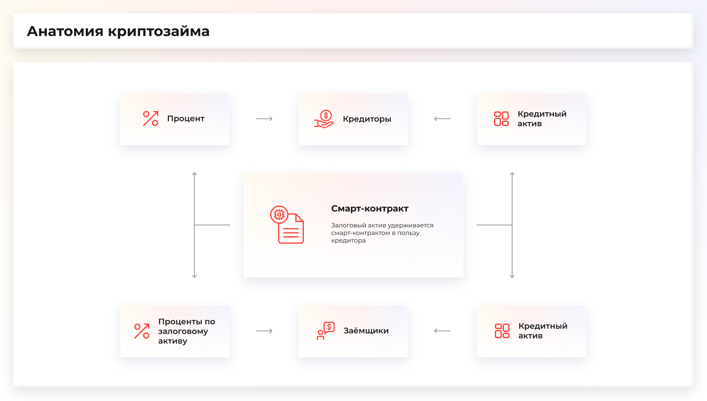
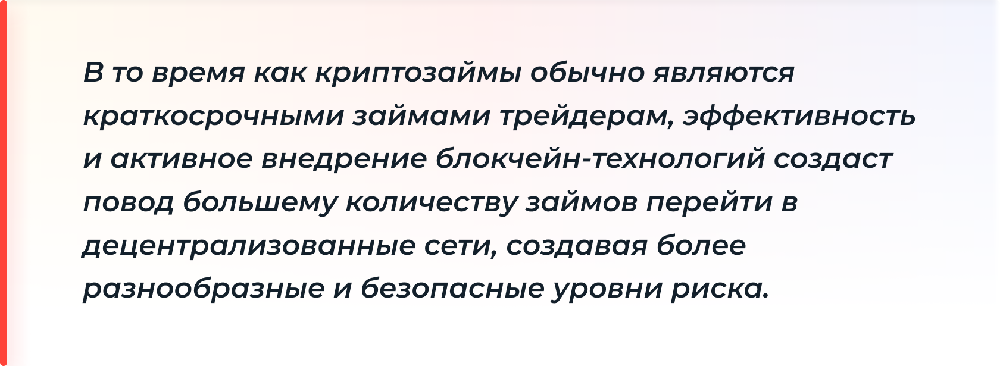
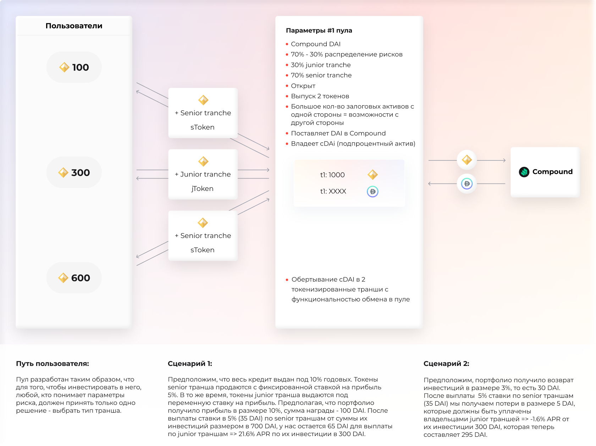
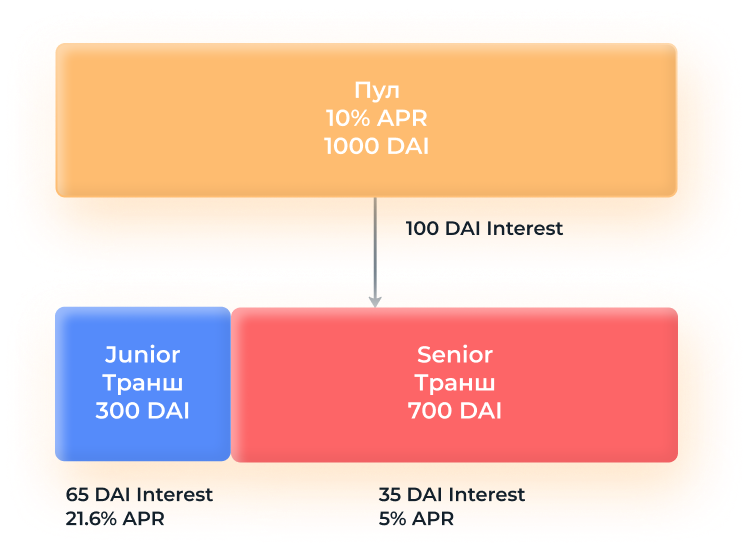
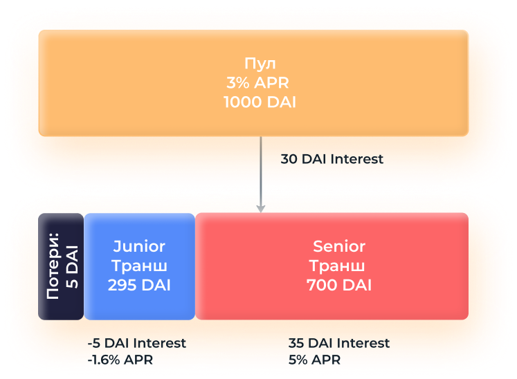
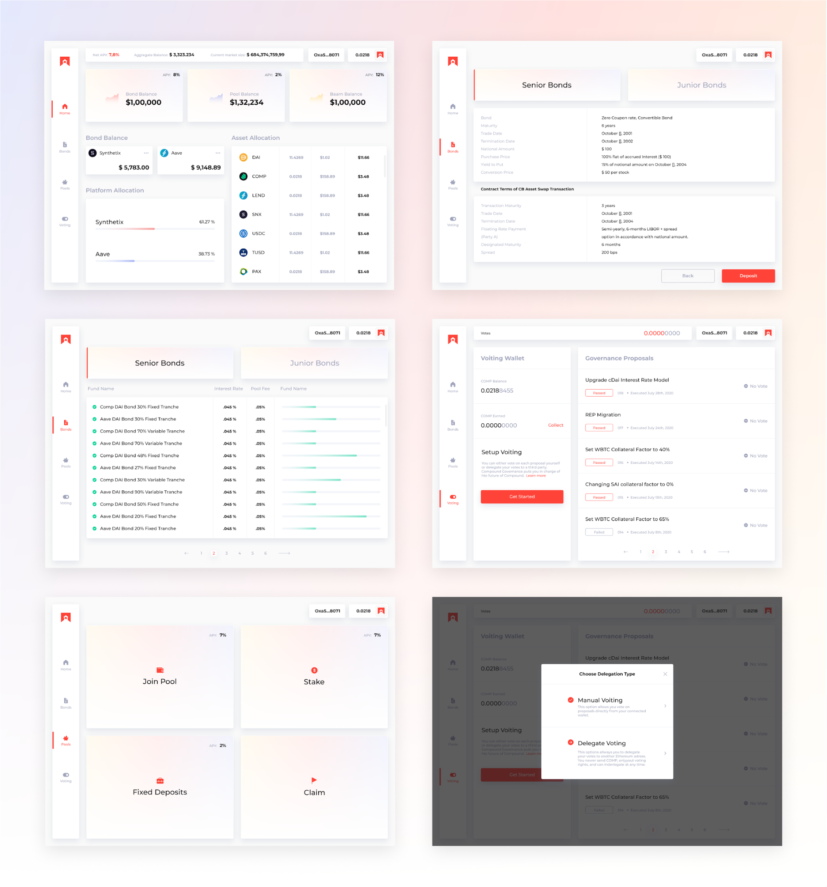
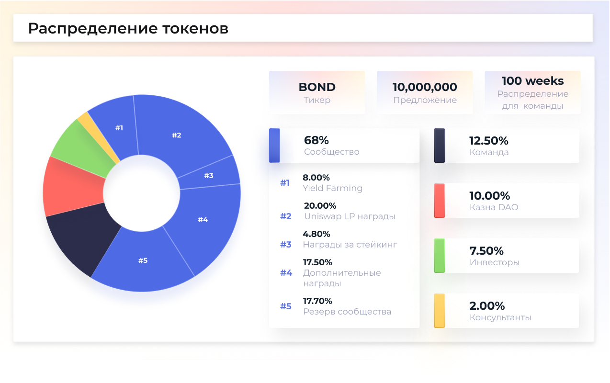
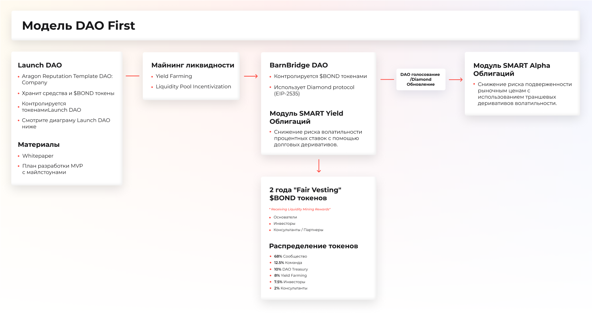
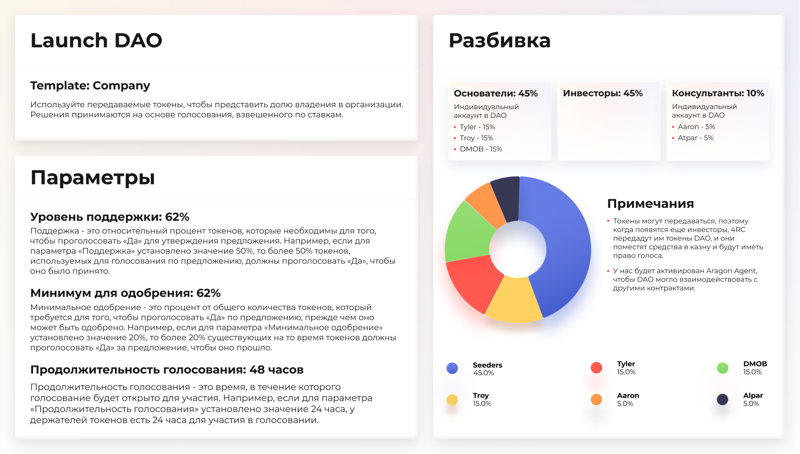
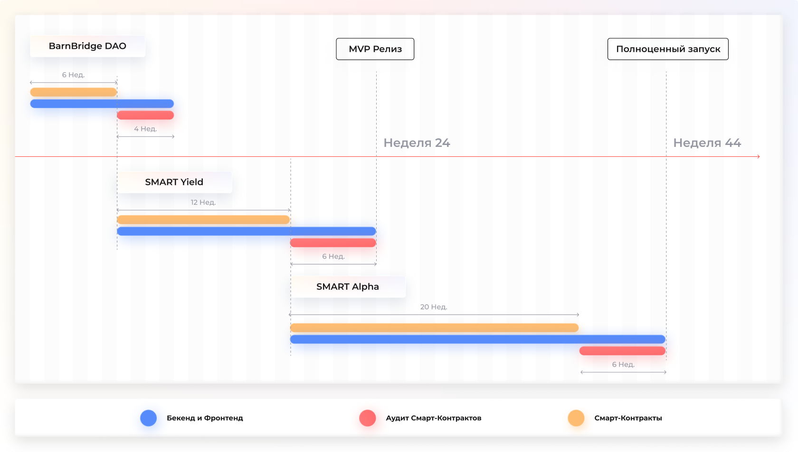

> **⚠ WARNING: this is a non-canonical translation**  
> The source of truth is alway the original [English Whitepaper](README.md)  
> Предупреждение: это неканонический перевод. Первоначальным источником является [английский оригинал](README.md).

-----------
  

# **Протокол для токенизации рисков**

#### Протокол колебаний деривативов для хеджирования уровней изменения доходности и рыночной цены.

## Аннотация

Идея и whitepaper BarnBridge возникли еще в первой половине 2019 года. В то время MakerDAO только набирал популярность, а пользователи все больше интересовались тематикой DeFi (децентрализованных финансов). Год спустя, c 60% общей доходности от мирового долга менее 1% и больше 15 триллионов долларов мирового долга с отрицательным индексом доходности, капитал продолжает перетекать в более рискованные источники дохода. И это не случайность или тренд. С исторической точки зрения, начиная с библейских времен, оборотный капитал используют для получения доходности, неся при этом относительно равноценные риски.

До финансового кризиса, вызванного Covid-19, на планете происходило ускорение темпов роста мирового долга. В 1 квартале 2020 года мировой долг вырос до 258 триллионов долларов. Эта цифра на 331% выше мирового ВВП по данным МИФ (IIF), который представляет мировые банки и финансовые институты. Учитывая, что Федеральная резервная система США имеет право на бесконечный выпуск наличных, вполне вероятно, что эти цифры увеличатся, и выпуск долговых обязательств в соотношении к ВВП продолжит ускоряться.

В традиционной финансовой системе, дальше – TradFi, мировой уровень долга увеличивается, в то время как доходность и процентные ставки снижаются. Между тем, существует децентрализованная финансовая система, дальше – DeFi, которая активно развивается в цифровой экономике с цифровыми активами и криптовалютами. В то время как TVL (Total Value Locked или уровень долга), то есть общее количество ресурсов в DeFi протоколах, увеличился с сотен миллионов в прошлом году до миллиардов долларов в 2020 году, доходность не снизилась до уровня TradFi систем. Наоборот, из-за более высоких уровней риска в сочетании с более высокой эффективностью, обеспечиваемой смарт-контрактными технологиями, годовая процентная доходность (APY) в DeFi намного выше, чем в TradFi. Оборотный капитал, следуя исторической тенденции, перемещается в рынки с более высокой доходностью. Вот почему мы видим, как TVL в DeFi системах быстро растет. И эта тенденция будет продолжаться.

Сейчас, как никогда, существует огромная потребность в привычных TradFi инструментах для DeFi экосистемы. **BarnBridge — идея, время которой пришло.**

## Уровни управления рисками и TradFi мосты

Продуктами доходности на децентрализованных рынках, которые дают более высокий APY, чем продукты доходности на традиционных рынках, в настоящее время являются кредиты, обеспеченные криптовалютой. Вместо того, чтобы продавать криптовалюту за фиат, заемщики стейкают ее и получают проценты взамен. Несмотря на то, что эти кредиты в основном были краткосрочными займами трейдерам, система оказалась эффективной и масштабируемой. Это приведет к тому, что более долгосрочные и крупные кредиты перейдут в децентрализованные реестры. Эффективность DeFi связана с тем, что смарт-контракты могут алгоритмически удерживать залог до тех пор, пока обе стороны сделки не выполнят свои обязательства. Сокращение трудозатрат для обслуживания финансовых операций на этом рынке позволит уменьшить и стоимость поддержания экосистемы. Такая эффективность, в сочетании с осознанием повышенного риска, обусловливает более высокую доходность децентрализованных систем. По мере того, как риск в DeFi приближается к уровню риска в TradFi, а криптовалютные кредиты трейдерам, переходят например, в ипотечные кредиты домовладельцам, эффективность смарт-контрактов и далее будет обеспечивать более высокую доходность DeFi, чем TradFi.

Более того, эффективность смарт-контрактов и технологий DAO позволяет создавать гораздо более сложные деривативные инструменты и обеспечивает уровень прозрачности и безопасности, недоступный современным финансовым системам.

Все эти меры повышения эффективности в настоящее время ограничены и построены на кредитах, обеспеченных криптовалютой.

Как уже обсуждалось ранее, эта эффективность должна экстраполироваться на переход ипотечных и корпоративных долгов в децентрализованные платформы на более длительные сроки. Это должно также стимулировать переход в децентрализованные платформы более сложных деривативов. Мы будем иметь возможность структурировать более сложные деривативы и отслеживать их с гораздо большей эффективностью и прозрачностью, чем это было возможно до реализации технологии блокчейн, криптовалют, смарт-контрактов и децентрализованных автономных организаций. Долговые и доходные деривативы на сумму 244 триллиона долларов США со временем продолжат переходить на более эффективные технологии. Перемещение доходных деривативов из менее эффективных централизованных финансовых систем в более эффективные децентрализованные финансовые системы станет одним из крупнейших передвижений богатства в истории человечества. **BarnBridge существует для того, чтобы облегчить этот переход и сделать децентрализованную финансовую систему более эффективной.**

Существует огромный рынок для людей, желающих войти в крипту, которые (1) не хотят нести все риски владения, кредитования или получения целого цифрового актива, и (2) никогда не будут использовать децентрализованные автономные организации (DAO) для создания смарт-контракта, который алгоритмически записывает обе стороны займа или соглашения. Более 99,9% мирового долга по-прежнему структурировано через традиционные рынки, которым нужно больше доходности. С другой стороны, более продвинутые финансовые компании имеют различные уровни допустимости риска. Это позволяет по разному структурироваться в каждой точке кривой доходности, при этом наиболее рискованные (вероятно, хедж-фонды) инвестируют наименьшее количество денег с целью получения наибольшей доходности для своей ставки/хеджа. Более консервативные инвесторы, напротив, часто готовы отказаться от значительной части возможностей повышения доходности, чтобы получить доступ к более безопасным инструментам. “Безрисковые” продукты, как описывает их TradFi, в настоящее время не представлены в децентрализованной финансовой экосистеме. Возможность структурировать эти виды инструментов позволит консервативным инвесторам с традиционных рынков перейти на децентрализованные рынки.

В краткосрочной перспективе (DeFi) и среднесрочной (Proof of Stake) уровни управления рисками продолжат создавать рынки и индустрии для традиционных инвестиционных фирм, которые хотят получать выше 1% доходности. По мере того, как это произойдет, все больше и больше займов будет перемещаться в децентрализованную экосистему. В долгосрочной перспективе, и частично во время процесса, кредиторы и заемщики поймут, почему децентрализованные и надежные посредники лучше и дешевле, чем текущие. По мере того, как это будет происходить, все большие суммы 244 триллионов долларов мирового долга перейдут в блокчейн, создавая возможности для повышения доходности, уровней управления рисками, и продуктов обеспеченных долговых обязательств для вкладчиков коммерческих банков и финансовых рынков нового поколения.

## 1. Протокол для токенизации рисков

BarnBridge — первый протокол для токенизации рисков. До появления технологии смарт-контрактов было практически невозможно надежно и прозрачно отследить и сопоставить доходность части распределенного капитала, и обеспечить хеджирование от колебаний. Фактически, можно построить деривативные продукты для хеджирования рисков с рыночных колебаний любого типа. Примерами могут служить, в частности, эластичность процентных ставок, колебания базовой рыночной цены, колебания прогнозируемых рыночных коэффициентов, колебания ставок по ипотечным кредитам, колебания цен на сырьевые товары и, казалось бы, бесконечное количество рыночных колебаний для хеджирования той или иной конкретной позиции.

Мы планируем создать первый кросс-платформенный протокол для любых и всех колебаний. Для начала мы сосредоточимся на колебаниях доходности и рыночной цене. Впоследствии, мы планируем внедрить гораздо больше возможностей для хеджирования против колебаний в децентрализованной экосистеме. BarnBridge стремится быть платформо и активо независимым.

Вы можете снизить риски цифровых активов и колебаний доходности цифровых активов, разбивая их на практически бесконечные и отдельные части или транши, выраженные в долларах, создавая деривативы из этих траншей. BarnBridge стремится снизить кривую риска и предложить многоуровневое управление рисками инвесторам как DeFi, так и TradFi, путем создания более эффективных деривативов на основе долговых обязательств и доходности.

## 2. Стартовые продукты

SMART $BONDS - **S**tructured **M**arket **A**djusted **R**isk **T**ranches

2.1 SMART Yield Облигации

Снижение риска волатильности процентных ставок с помощью долговых деривативов.

В настоящее время децентрализованная финансовая система в основном предлагает годовые с плавающей ставкой. Однако возможность структурировать доходность фиксированными ставками станет реальной благодаря залогам со сроком погашения, или деривативам, а также фиксированной доходностью без срока погашения или аннуитетов. Мы не считаем это новаторской идеей и предполагаем, что такие продукты со временем появятся в DeFi. Тем не менее, разновидность деривативов и упрощение финансового планирования, которые вы сможете структурировать и реализовать при наличии фиксированной доходности в смарт-контрактах, будут революционными для традиционных финансовых рынков.

Децентрализованные финансовые инструменты демонстрируют способности надежной и безупречной финансовой отрасли. Одни из основополагающих проектов в DeFi, такие как MakerDAO, Synthetix, AAVE, Compound, Curve, приносят доход пользователям, которые не обременены ограничениями TradFi инструментов и полагаются на алгоритмы, надежные оракулы и децентрализованные базы данных. Многочисленные децентрализованные платформы предлагают различную рыночную доходность, но нет продукта, который бы объединял различные децентрализованные протоколы и нормализовал кривую риска и деривативы для уменьшения рисков.

Возможность получать доход из нескольких протоколов и разных траншей одновременно существует на традиционных финансовых рынках, но более эффективна на децентрализованных финансовых рынках, предполагая приемлемый уровень ликвидности.

Первая версия нашего продукта позволит пользователям DeFi не только получать фиксированную доходность, но и получить доступ к пулам, работающим с несколькими протоколами экосистемы. Это, в свою очередь, создаст более эффективный рынок и сбалансирует кривую доходности по всей отрасли.

В то время как мы ожидаем, что отдельные протоколы кредитования будут внедрять концепции фиксированного дохода на своих платформах, главным отличием кросс-протокольного подхода к фиксированному доходу является диверсификация рисков, связанных с активами и платформами. Алгоритмически объединяя цифровые активы на кредитных платформах, мы сможем добиться большей эффективности, распределяя риски и нормализуя кривую риска отрасли. Поскольку BarnBridge не выдает кредитов напрямую, а объединяет кредитование в рамках индустрии, это позволит нам быть платформо и активо независимыми, что, в свою очередь, позволит организовать более сложную структуру и рейтинг облигаций.

**Сценарии риска и потерь.**

**Сценарий 1:**

**Сценарий 2:**

Объединенный залог будет отправлен в кредитные протоколы или контракты, генерирующие прибыль, а доходность будет токенизирована и объединена в транши. Таким образом можно будет вложить в senior транш и получить меньшую доходность, но с гораздо более низким профилем риска. SMART облигации – это способ купить и продать риск на доходность, цены на который определяются исключительно рынком.

[Детали финансового структурирования можно посмотреть здесь.](Https://docs.google.com/spreadsheets/d/157p5D_E_j_zYwc_QzHmVeJH_L64HubkXDPdMwVUkypY/edit#gid=2024388043)

## 2.2 SMART Alpha Облигации

Снижение риска воздействия рыночных цен с использованием траншевых волатильных облигаций.

SMART Alpha облигации будут структурированы не через традиционные транши доходности, а с различными уровнями рыночного ценового воздействия. Идея заключается в том, что каждый транш ценового воздействия не обязательно должен быть линейным по всей кривой риска, то есть первые $100 ценового воздействия не должны иметь одну и туже волатильность вверх и вниз. **Это похоже на долевое владение, но с разным риском и вознаграждением за долю.**

Например, если текущая цена 1 ETH ожидается на уровне $1000 и движется к $900, то первый транш (самый рискованный транш) получает самый высокий процент убытка. И наоборот, если текущая цена 1 ETH ожидается на уровне $1000, но движется к $1100, то первый транш (самый рискованный транш) получает больший процент прибыли.

Эта прибыль или убыток измеряется и распределяется между траншами алгоритмически с помощью смарт-контрактов. Каждый транш может быть продан как уникальный цифровой актив. Например, jETH (junior транш ценового воздействия ETH), mETH (mezzanine транш ценового воздействия ETH), и sETH (senior транш ценового воздействия ETH). Эти транши будут существовать в качестве уровней риска.

Продукт SMART Alpha позволит строить транши из пулов из одного или нескольких активов для получения доходности. Транши с низким уровнем риска будут получать более низкую доходность при росте цены активов, и более низкие потери при падении цены активов.

#### 2.3 UI/UX интерфейс (светлый)

#### 2.4 UI/UX интерфейс (темный)

## 3. Токен - $BOND

$BOND является ERC-20 токеном. Он будет использован для стейкинга в системе как токен управления, когда будет запущен модуль управления. Так как он соответствует стандарту ERC-20, токен $BOND можно обменять на любой бирже и хранить в любом кошельке, что открывает доступ к токену каждому.

### 3.1 Распределение

План распределения разработан для обеспечения децентрализации протокола.

#### 3.1.1 График распределения

График распределения токенов создан для устранения возможности манипуляции токенами на рынке. Токены, выделенные основателям, инвесторам и консультантам, заблокированы в смарт-контракте, который еженедельно распределяет их в течении 2-летнего периода. Распределение начнется с запуска программы Yield Farming. 

Разбивка:

- Общее количество $BOND токенов: 10,000,000
- Процент $BOND токенов, выделенных основателям, инвесторам и консультантам: 22%
- Общее количество выделенных $BOND токенов: 2,200,000
- Период распределения: 100 недель
- Частотность распределения: 1 неделя
- Количество $BOND токенов, распределяемых каждую неделю: 22,000
- Процент $BOND токенов, распределяемых каждую неделю: 0.22%

### 3.2 Управление

#### 3.2.1 Подход “DAO First”

BarnBridge использует подход “DAO First” для раскрутки протокола, предпочитая с самого начала использовать децентрализованные инструменты для достижения цели — полной децентрализации, имея гибкую систему смарт-контрактов, которая будет добавлять/обновлять/удалять функциональность на основе предложений участников DAO. Будет создан инкубатор DAO под названием Launch DAO и конечный протокол DAO под названием BarnBridge DAO.

#### **Launch DAO**

Начиная с Launch DAO, основатели, инвесторы и консультанты используют Aragon DAO Company Template, который использует токены для отображения доли собственности. Решения принимаются на основании взвешенного голосования. Нативным токеном Launch DAO будет $BBVOTE. Основатели получат 45%, инвесторы — 45%, консультанты — 10%. Минимальный процент проходимости предложения будет установлен на уровне 62%, что значит, что для принятия решения необходимо иметь минимум 62% голосов.

Средства от инвесторов и выпущенные токены $BOND будут хранится в казне Launch DAO. В Launch DAO также будет активирован Aragon Agent, и мы, возможно, разработаем интеграцию для распределения пулов Uniswap и Balancer непосредственно в DAO.

#### **BarnBridge DAO**

BarnBridge DAO будет контролироваться $BOND сообществом. DAO будет иметь полный контроль над протоколом и встроенными функциями. Мы осуществляем это с помощью Diamond Standard (EIP-2535). Стандарт позволяет нам обновлять протокол без необходимости удаления токенов и перехода к 2 версии протокола. BarnBridge DAO будет иметь полный контроль над Diamond, что позволит обеспечить удивительную гибкость в WEB3 пространстве. Мы подробно рассмотрим это в разделе “Смарт-контракты” (4.2.1).

## 4. Объем работ

### 4.1 Введение в разработку

Последующий раздел описывает MVP / Бета релиз продукта. Он поможет определить направление развития продукта, позволит начать сбор данных и обеспечить соответствие продукта потребностям рынка.

Мы полны решимости предоставить пользователям отличный UX, надав возможность анализировать статистику предыдущих пулов, чтобы упростить процесс принятия решения когда и как присоединиться к ним. Тем не менее, мы ожидаем и надеемся, что сообщество создаст отдельные инструменты аналитики, которые дополнят основной продукт.

### 4.2 Компоненты и сроки

#### **Launch DAO**

Мы будем использовать Aragon DAO Company Template для создания первоначального DAO. Так как эти контракты уже разработаны и находятся в использовании долгое время, мы доверяем их функциональности и возможностям.

Мы рассчитываем внести минимальные изменения в исходный код. Тем не менее, мы создадим тесты для наиболее распространенных вариантов использования, чтобы убедится в функциональности и доступном UX для присоединения к DAO.

- Время на создание, тестирование и запуск: **Готово**

#### **BarnBridge DAO**

Для последующего DAO потребуется несколько специфических функций, которых нет в Aragon DAO Company Template. Поэтому мы, скорее всего, выберем обновляемую систему смарт-контрактов (такую как [EIP-2535](https://eips.ethereum.org/EIPS/eip-2535)), которая позволить добавлять, удалять и обновлять функциональность по усмотрению сообщества.

BarnBridge DAO станет основным компонентом платформы BarnBridge, поскольку децентрализованные решения позволят реализовать наилучшие инициативы для благополучия сообщества.

- Время на создание, тестирование и запуск на тестовой сети: **6 недель**

Дополнительный внешний аудит отодвинет запуск на основной сети примерно на **4 недели**. Больше информация в разделе 4.2.2 “Аудиты и симуляции”.

#### **SMART Yield Облигации**

Все настройки DAO определены таким образом, чтобы утвердить курс в направлении к SMART Yield Облигациям. Это первый DeFi продукт платформы BarnBridge.

Поскольку DAO контролирует всю систему, а это значит, что сообщество решает, как система будет использоваться, параметры этого DeFi продукта будут частично определяться сообществом. Некоторые из других параметров будут определяться децентрализованной системой-оракулом (например, Chainlink), которая должна установить правильные, реальные и допустимые параметры для того, чтобы пулы были валидными.

- Время на создание, тестирование и запуск на тестовой сети (включая систему-оракул): **12 недель**

Дополнительный внешний аудит отодвинет запуск на основной сети примерно на **6 недель**. Больше информация в разделе 4.2.2 “Аудиты и симуляции”.

#### **SMART Alpha Облигации**

Следуя модели SMART Yield Облигаций, DAO контролирует процесс установки и параметры для SMART Alpha Облигаций. Кроме того, смарт-контракты оракулов будут иметь решающее значение при определении цены активов, а также цены, когда начинается и заканчивается период пула, чтобы обеспечить справедливое распределение прибыли или убытков.

This DeFi product is composed of the actual pool contracts the users interact with, specific deployment factories, which deploy and set up the pool contracts, and the complimentary back-end and front-end.

- Время на создание, тестирование и запуск: **20 недель**

Дополнительный внешний аудит отодвинет запуск на основной сети примерно на **6 недель**. Больше информация в разделе 4.2.2 “Аудиты и симуляции”.

#### 4.2.1 Смарт-контракты

Поскольку мы стремимся к полной децентрализации, вся инфраструктура будет основываться на DAO, управляемой сообществом. DAO будет владельцем основных контрактов системы и сможет определять их функциональность.

В архитектуре мы используем [Diamond Standard (EIP-2535)](https://eips.ethereum.org/EIPS/eip-2535), который позволит смарт-контрактам добавлять, обновлять или удалять функциональность. Смарт-контракты Ethereum ограничены максимальным размером в 24KB, однако реализация этого стандарта позволяет обойти это ограничение.

Стандарт также позволит BarnBridge DAO выбирать функциональность и как ее изменять. Если мы обещаем, что конкретная функциональность будет позже исключена из контрактной системы, мы можем удалить байткод, который описывал эту функциональность. Это позволит избежать риска повторного включения этой части контракта в будущем. Так как мы можем удалять конкретные части контракта, мы удаляем ненужное из системы, оставляя ее достаточно гибкой и доступной к аудитам.

Этот EIP обеспечивает много преимуществ не только нашему протоколу, но и целой экосистеме Ethereum на агрегированном уровне.

Чтобы сохранить философию децентрализованности, мы будем использовать децентрализованную систему оракулов, такую как Chainlink. Это позволит нам выполнять вычисления вне сети, которые впоследствии будут использованы в блокчейне. Это будет полезно для настройки параметров пула, таких как APY кредитования. Конечно, эта автономная система может быть заменена и модернизирована DAO.

#### 4.2.2 Аудиты и симуляции

Чтобы убедится в том, что наша платформа работает так, как мы ожидаем, мы будем проводить многочисленные внутренние аудиты на протяжении всего цикла разработки. Наша команда способна писать безопасный код, который соответствует спецификациям.

В дополнение к внутреннему аудиту, мы будем проводить внешний аудит, привлекая ведущие компании на рынке. Внешние аудиты – необходимая практика, так как команда не всегда может оценить написанный код со свежим взглядом. Внешний аудит выявляет несоответствия между спецификациями и реализацией, следит за тем, чтобы документация обновлялась, тестирует модель безопасности смарт-контрактов и создает лучший опыт для взаимодействия субъектов с контрактами.

Помимо аудита, мы также будем проводить агентное моделирование для симуляции различных сценариев и поведения пользователей с целью визуализации того, как система развивается с течением времени. Мы можем симулировать различные пользовательские стратегии взаимодействия с нашей системой и исследовать как изменяются свойства системы.

Мы также проведем формальную верификацию функциональности основных контрактов. Формальная верификация – это дорогостоящий и сложный процесс, но он обеспечивает дополнительную безопасность. Основные составляющие системы будут смоделированы и официально проверены не только нашей командой, но и внешними аудиторами. Это чрезвычайно важно, так как распределение, внутренний учет, математические свойства и специфические вариации обеспечивают безопасность наших пользователей.

### Пост MVP

Пост MVP или следующий релиз продукта будет иметь релиз основной сети в качестве изюминки. Протоколо независимые SMART Yield Облигации, а также разработка и тестирование продукта SMART Alpha определят пост MVP и завершат запуск полнофункционального протокола BarnBridge и продуктов. Продукт Smart Yield и обеспечение ликвидности будут запущены до запуска продукта Smart Alpha.

## 5 Будущая работа

#### 5.1.1 Газ комиссии

Поскольку необходимо выполнять несколько операций с разной стоимостью газа, их стоимость может довольно быстро накапливаться. Существуют решения 2-го уровня, которые повышают масштабируемость и позволяют выполнять более сложные операции и большее количество транзакций, одновременно сокращая расходы на это. Потенциальным решением, которое уже работает на основной сети, является zk rollups, которые предлагает объединение трансферов в одну транзакцию. Большинство вычислений выполняется вне блокчейна. Это позволяет достичь гораздо большей пропускной способности, снизить затраты и, что не менее важно, не влияет на безопасность. Для приложения, которым будет пользоваться большое количество пользователей, решение, нацеленное на масштабируемость – правильный путь.

#### 5.1.2 SMART Свопы — кредит, разбитый на 4 инструмента

#### 5.1.3 SMART Хедж-Прогнозы - Хеджирование колебаний деривативов при прогнозировании рыночных коэффициентов.

#### 5.1.4 Рыночные рейтинги Oracle - Индекс точки привязки

Используя знания сообщества, мы можем создать индекс, который будет работать как рейтинговая система, обеспечивающая механизм оракула, который может быть использован любой платформой в DeFi.

Система оценки рисков, используемая для определение рейтинга траншей, может быть использована для определения настроений рынка. Если более рискованные транши более популярны, это может быть ранним признаком того, что основные компоненты менее рискованные. Точно так же, если использование более безопасных траншей с более низкой доходностью увеличится в объемах, это может быть ранним признаком того, что была найдена уязвимость и атака потенциально неминуема.

## 6. Команда

### 6.1 Основная команда

- **Трой Мюррей (Troy Murray)** - Трой управляет творческой криптокомпанией RUDE_labs. Трой начал изучать преимущества блокчейна для медиа и артистов с 2012 года. С того времени он работает в крипто пространстве, посвящая большую часть своего времени Ethereum-проектам. Ранее работал над SingularDTV/Breaker и snglsDAO, пытаясь децентрализовать сферу медиа и развлечений. До этого в 2016 году создавал платформу краудфандинга Title III, используя токены Ethereum.
- **Тайлер Уард (Tyler Ward)** - Тайлер управляет Proof Systems, одной из крупнейший маркетингових и UI/UX компаний, специализирующейся на цифровых активах. Тайлер работал с компаниями Consensys, Earn.com (которая была приобретена компанией Coinbase), FOAM, Dether, & Grid +, Centrality, Sylo, NEAR Protocol, DARMA Capital, SingularDTV & snglsDAO. Он работает в криптоиндустрии с 2016 года, а также приобрел и продал несколько компаний в сфере электронной коммерции.

***Digital MOB – Digital MOB имеет опыт создания сложных блокчейн проектов. Компания берет на себя техническую роль в продукте, предоставляя команду опытных web3-разработчиков, веб и мобайл разработчиков, системных архитекторов, экспертов по безопасности и аналитиков.***

- **Милад Мостави (Milad Mostavi)** - Милад является сооснователем и управляющим DigitalMOB. За последние 5 лет он работал с компанией Consensys над десятками различных блокчейн-проектов. Его вклад сыграл решающую роль в успешном запуске SingularDTV и Gnosis
- **Богдан Георге (Bogdan Gheorge)** - Богдан считает себя DeFi-ветераном. Имея опыт в математике и анализе данных, он провел последние 2 года в Alethio, занимаясь анализом данных на блокчейне, используя и исследуя практически все DeFi протоколы. Также работал над разработкой и продажей API для данных CoDeFi DeFi. Теперь Богдан входит в состав Digital MOB, где отвечает за менеджмент продукта и создание DeFi продуктов.
- **Драгос Рическу (Dragos Rizescu)** - Драгос отвечает за разработку продуктов в Digital MOB. Он имеет опыт фулл-стек разработчика, увлекается построением высокомасштабируемых пользовательских интерфейсов, последние 5 лет находится в авангарде WEB3-технологий. Он соосновал Treum.io, блокчейн-решение для обеспечения прозрачности, отслеживания и пригодности для торговли ценными физическими активами. Как разработчик, он был частью основной команды при запуске таких проектов, как Gnosis и SingularDTV, а также консультировал и поддерживал несколько проектов в экосистеме, в частности Alethio. Он работал с компанией Consensys для поддержки корпоративного подразделения компании, являясь частью команды разработчиков, представившей первый нефинансовый вариант использования Ethereum, а также решений для децентрализованных энергетических рынков.

### 6.2 Консультанты/Технологические партнеры

- **Аарон МакДональд (Aaron McDonald)** - соучредитель и CEO Centrality. Аарон – ветеран индустрии с 20-летним опытом управления командами в технологичных компаниях с инвестиционными портфелями на сумму более 1 млрд. долларов США. Аарон основал Centrality – ведущую мировую венчурную студию стоимостью 100 млн. долларов, которая поддерживает инвестиционный портфель, используя децентрализованные технологии для создания новых инноваций и клиентского опыта на рынке. Аарон является членом совета директоров или консультантом более десятка венчурных компаний по всему миру. В 2018 году Аарон был удостоен звания “Предприниматель года в сфере технологий и развивающихся отраслей”.
- **Atpar** - компания, которая создала ACTUS протокол, целью которого является предоставление сообществу Ethereum инструментов для реализации видения открытой, взаимозаменяемой и бесконфликтной финансовой экосистемы. В основе протокола ACTUS лежат алгоритмические контрактные типы унифицированных стандартов,, которые являются стандартизированным представлением всех видов финансовых контрактов с точки зрения их юридических обязательств.

## 6.3 Команда разработчиков
- 1 руководитель проекта
- 1 программный архитектор, QA специалист и DevOps
- 2 Solidity разработчика
- 2 фронтенд разработчика
- 1 бэкенд разработчик

